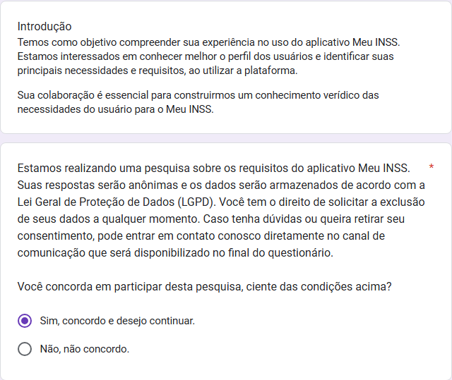

# 
Questionário

# 
Introdução

O questionário é uma técnica comum de coleta de dados que envolve a apresentação de um conjunto de perguntas a indivíduos ou participantes, geralmente na forma de formulários impressos ou online. A finalidade dos questionários é obter informações necessárias para pesquisas, análises ou avaliações, que nesse caso será utilizado para coletar informações sobre o perfil dos usuários do aplicativo do Meu INSS.[1]

# 
Metodologia

A equipe realizou nos dias 15/11/2024 a 22/11/2024 um questionário, na plataforma Google Forms, com o intuitor de conhecer o perfil de usuário do app Meu INSS. O questionário contava com 13 perguntas (Figuras 1 a 14), sendo uma delas o termo de consentimento, e as demais que exploravam conhecer as características sócio demográficas dos usuários do aplicativo e interações com o sistema. O processo contou com 25 participantes, sendo 25 (100%) usuários do aplicativo e todos concordaram com o termo de consentimento.

  
<b>Figura 1: Termo de consentimento</b>

  <b>Fonte: <a href="https://github.com/CristianoMoraiss">Cristiano Morais, </a>
  <a href="https://github.com/julia-fortunato">Julia Fortunato, </a>
  <a href="https://github.com/nickgehjk">Nicolas Bomfim </a>
  </b>

Como pode ser observado na figura 2, temos que a faixa etária dos participantes do questionário é bastante variada e distribuída, tem-se que: 12% estão na faixa de 18 até 24 ; 28% estão na faixa de 25 até 34 ; 4% estão na faixa de 35 até 44 ; 20% estão na faixa de 45 até 54 ; 20% estão na faixa de 55 até 64 ; 16% estão com mais de 65 anos.

  
<b>Figura 2: Pergunta 1 do questionário</b>

  <b>Fonte: <a href="https://github.com/CristianoMoraiss">Cristiano Morais, </a>
  <a href="https://github.com/julia-fortunato">Julia Fortunato, </a>
  <a href="https://github.com/nickgehjk">Nicolas Bomfim </a>
  </b>

Observando a figura 3, é possível constatar que o gênero dos participantes é bem dividido, sendo que 48% dos participantes informaram ser do sexo masculino enquanto que 52% eram do feminino.

  
<b>Figura 3: Pergunta 2 do questionário</b>

  <b>Fonte: <a href="https://github.com/CristianoMoraiss">Cristiano Morais, </a>
  <a href="https://github.com/julia-fortunato">Julia Fortunato, </a>
  <a href="https://github.com/nickgehjk">Nicolas Bomfim </a>
  </b>

Na figura 4, é possível notar os dados relacionados ao grau de escolaridade dos participantes, tal que é: Ensino Fundamental Incompleto (0%); Ensino Fundamental Completo (12%); Ensino Médio Incompleto (8%); Ensino Médio Completo (36%); Ensino Superior Incompleto (12%); Ensino Superior Completo (32%). 

  
<b>Figura 4: Pergunta 3 do questionário</b>

  <b>Fonte: <a href="https://github.com/CristianoMoraiss">Cristiano Morais, </a>
  <a href="https://github.com/julia-fortunato">Julia Fortunato, </a>
  <a href="https://github.com/nickgehjk">Nicolas Bomfim </a>
  </b>

Na figura 5, são mostrados os dados da distribuição dos participantes em relação a seu grau de intimidade com tecnologia sendo que 1 é pouca intimidade e 5 é muita intimidade. Os dados se distribuiram em: 1 (8%); 2 (24%); 3 (20%); 4 (28%); 5 (20%).

  
<b>Figura 5: Pergunta 4 do questionário</b>

  <b>Fonte: <a href="https://github.com/CristianoMoraiss">Cristiano Morais, </a>
  <a href="https://github.com/julia-fortunato">Julia Fortunato, </a>
  <a href="https://github.com/nickgehjk">Nicolas Bomfim </a>
  </b>

Observando a figura 6, é possível verificar os dados em relação a renda dos participantes do questionário, os dados ficaram distribuidos em: Sem renda (16%); Até 1 salário mínimo (12%); Até 3 salários mínimos (40%); Até 5 salários mínimos (16%); Mais de 5 salários mínimos (8%); Prefiro não informar (8%).

  
<b>Figura 6: Pergunta 5 do questionário</b>

  <b>Fonte: <a href="https://github.com/CristianoMoraiss">Cristiano Morais, </a>
  <a href="https://github.com/julia-fortunato">Julia Fortunato, </a>
  <a href="https://github.com/nickgehjk">Nicolas Bomfim </a>
  </b>

Analisando a figura 7, podemos observar o grau de utilização do "Meu INSS" que os participantes declararam, obteve-se o seguinte resultado: Raramente (52%); Às vezes (36%); Quase sempre (12%); Sempre (0%).

  
<b>Figura 7: Pergunta 6 do questionário</b>

  <b>Fonte: <a href="https://github.com/CristianoMoraiss">Cristiano Morais, </a>
  <a href="https://github.com/julia-fortunato">Julia Fortunato, </a>
  <a href="https://github.com/nickgehjk">Nicolas Bomfim </a>
  </b>

A partir da figura 8, podemos ver os dados de avaliação que os participantes forneceram para o "Meu INSS" sendo 0 muito ruim e 5 muito bom, tiveram-se os seguintes resultados: 1 (16%); 2 (16%); 3 (24%); 4 (32%); 5 (12%).

  
<b>Figura 8: Pergunta 7 do questionário</b>

  <b>Fonte: <a href="https://github.com/CristianoMoraiss">Cristiano Morais, </a>
  <a href="https://github.com/julia-fortunato">Julia Fortunato, </a>
  <a href="https://github.com/nickgehjk">Nicolas Bomfim </a>
  </b>

Na figura 9, pode-se observar como os participantes avaliaram o aplicativo em termos de dificuldade de acharem o que precisam, 0 significa muita dificuldade e 5 significa pouca dificuldade, obteve-se os seguintes resultados: 1 (26%); 2 (20%); 3 (20%); 4 (24%); 5 (13%).

  
<b>Figura 9: Pergunta 8 do questionário</b>

  <b>Fonte: <a href="https://github.com/CristianoMoraiss">Cristiano Morais, </a>
  <a href="https://github.com/julia-fortunato">Julia Fortunato, </a>
  <a href="https://github.com/nickgehjk">Nicolas Bomfim </a>
  </b>

Observando a figura 10, vemos as respostas relativas a facilidade de uso do aplicativo "Meu INSS" sendo 5 muito fácil de usar e 0 muito difícil, os dados foram os seguintes: 1 (16%); 2 (24%); 3 (28%); 4 (24%); 5 (8%). 

  
<b>Figura 10: Pergunta 9 do questionário</b>

  <b>Fonte: <a href="https://github.com/CristianoMoraiss">Cristiano Morais, </a>
  <a href="https://github.com/julia-fortunato">Julia Fortunato, </a>
  <a href="https://github.com/nickgehjk">Nicolas Bomfim </a>
  </b>

Na figura 11, temos os dados relativos ao quão agradável os participantes acham a interface do aplicativo, sendo que 0 é pouco agradável e 5 é muito agradável: 1 (24%); 2 (12%); 3 (24%); 4 (32%); 5 (8%)

  
<b>Figura 11: Pergunta 10 do questionário</b>

  <b>Fonte: <a href="https://github.com/CristianoMoraiss">Cristiano Morais, </a>
  <a href="https://github.com/julia-fortunato">Julia Fortunato, </a>
  <a href="https://github.com/nickgehjk">Nicolas Bomfim </a>
  </b>

Observando a figura 12, é possível analisar os dados relativos ao tempo para realizar ações no aplicativo sendo 1 muito devagar e 5 muito rápido, tem-se:  1 (16%); 2 (24%); 3 (16%); 4 (32%); 5 (12%).

  
<b>Figura 12: Pergunta 11 do questionário</b>

  <b>Fonte: <a href="https://github.com/CristianoMoraiss">Cristiano Morais, </a>
  <a href="https://github.com/julia-fortunato">Julia Fortunato, </a>
  <a href="https://github.com/nickgehjk">Nicolas Bomfim </a>
  </b>

Em relação a figura 13, tem-se os dados relativos a qual funcionalidade os participantes mais utilizam no aplicativo. Cabe ressaltar que as fatias do gráfico com valores ocultos na imagem são todos 4%.

  
<b>Figura 13: Pergunta 12 do questionário</b>

  <b>Fonte: <a href="https://github.com/CristianoMoraiss">Cristiano Morais, </a>
  <a href="https://github.com/julia-fortunato">Julia Fortunato, </a>
  <a href="https://github.com/nickgehjk">Nicolas Bomfim </a>
  </b>

Por fim, a figura 14 mostra os dados relativos a quais funcionalidades os participantes acham mais importantes para um aplicativo do INSS.

  
<b>Figura 14: Pergunta 13 do questionário</b>

  <b>Fonte: <a href="https://github.com/CristianoMoraiss">Cristiano Morais, </a>
  <a href="https://github.com/julia-fortunato">Julia Fortunato, </a>
  <a href="https://github.com/nickgehjk">Nicolas Bomfim </a>
  </b>

# 
Resultados do questionário

Nesta seção, apresentamos as constatações feitas por meio dos resultados do questionário.

• Utilizando-se dos dados obtidos com o questionário, assim como a análise documental, temos que a idade dos usuários do Meu INSS é majoritariamente maior do que 25 anos e tendo uma distribuição quase igual entre os gêneros.    
• Em relação a escolaridade e renda, a maioria têm ensino médio completo ou ensino superior completo. Sua renda é majoritariamente até 3 salários mínimos.    
• O grau de intimidade com a tecnologia está com 68% concentrado de 3 até 5, ou seja, é uma intimidade média/alta.     
• Em relação a frequência de utilização do Meu INSS, os dados mostram que 88% dos participantes declararam que usam pouco.     
• A avaliação geral do aplicativo Meu INSS ficou com 68% das avaliações de 3 até 5, ou seja, majoritariamente consideram o aplicativo razoável/bom.   
• A dificuldade para encontrar o que precisa no aplicativo ficou majoritariamente de 1 até 3 com 64%, ou seja, tem-se uma dificuldade razoável/alta.   
• A facilidade de uso do aplicativo ficou majoritariamente de 1 até 3 com 68%, sendo assim considerado difícil/razoável de se usar.   
• Sobre o quão agradável é a interface os participante responderam com 64% de 3 até 5, logo a interface é considerada razoável/agradável.    
• As duas funcionalidades votadas como mais utilizadas foram simular aposentadoria e novo pedido/consultar pedido.    
• A atividade que os participantes consideraram o mais importante pra um aplicativo no INSS foi realização de pedidos/requerimentos.

             

 

## Referências bibliográficas 

> [1] SERRANO, Milene; SERRANO, Maurício. Elicitação, Modelagem e Análise - Aula 7. s.d. Slide 23 de 50. Disponível em: <a>https://aprender3.unb.br/pluginfile.php/2972449/mod_resource/content/2/Requisitos%20-%20Aula%2007.pdf</a>. Acesso em: 22 nov. 2024. 

## Bibliografia

> ZARANZA, Gabriel; ROSA, Gabriel. Questionário - Economia DF. 2023. Disponível em: [https://requisitos-de-software.github.io/2023.2-Economia-DF/elicitacao/tecnicas-perfil-usuario/questionario/]. Acesso em: 23 nov. 2024.

## Histórico de versões

| Versão | Data       | Descrição                            | Autor                                                 | Revisor                                               |
| :----: | ---------- | ------------------------------------ | ----------------------------------------------------- | ----------------------------------------------------- |
| `1.0`  | 23/11/2024 | Criação do documento                 | [Cristiano Morais](https://github.com/CristianoMoraiss)        |         |

