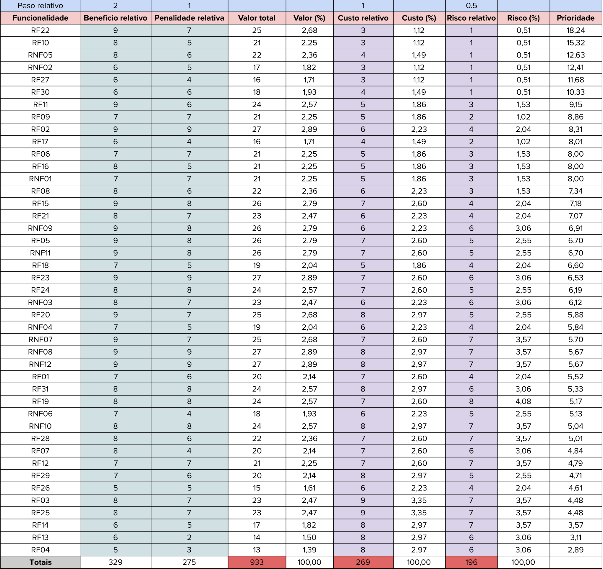

## Introdução

Para a utilização da técnica conhecida como First Things First, se faz necessário a observação e análise meticulosa do quão benéfico e custoso um determinado requisito será para o software, além disso também é considerado o custo de recursos e o risco para a produção do requisito, com isso é possível se ter uma dimensão dos impactos arquiteturais no sistema com sua implementação. Através da definição do benefício, penalidade, custo e risco se quantifica uma prioridade para cada um dos requisitos funcionais e não funcionais de um projeto afim de ordená-los em uma hierarquia de implementação, essa hierarquia maximiza o lucro e minimiza o risco.[1]

## Metodologia

No dia 24/11, por volta de 13 horas da tarde, foi realizada uma reunião via Microsoft Teams, no qual o objetivo era quantificar os benefícios, penalidades, riscos e custos de todos os requisitos que haviam sido elicitados através das técnicas de elicitação escolhidas pelo grupo. Nessa reunião participaram três membros do grupo, são eles: <a href="https://github.com/CristianoMoraiss">Cristiano Morais</a> (realizou o papel do desenvolvedor); <a href="https://github.com/mauricio-araujoo">Mauricio Ferreira </a>(realizou o papel de um usuário do Meu INSS, por meio de uma persona); <a href="https://github.com/julia-fortunato">Julia Fortunato</a> (realizou o papel de mediadora). É possível observar a descrição dos papéis abaixo e a relação na tabela 1:

- Mediador: Responsável por apresentar os requisitos elicitados pela equipe;
- Usuário: Responsável por classificar benefícios e penalidades na implementação de cada requisito;
- Desenvolvedor: Responsável por identificar custos e riscos na implementação de cada requisito.

<b>Tabela 1:</b> Membros participantes

<table>
  <thead>
    <tr>
      <th>Nome</th>
      <th>Papel</th>
    </tr>
  </thead>
  <tbody>
    <tr>
      <td><a href="https://github.com/CristianoMoraiss">Cristiano Morais</a></td>
      <td>Desenvolvedor</td>
    </tr>
    <tr>
      <td><a href="https://github.com/mauricio-araujoo">Mauricio Ferreira </a></td>
      <td>Persona, Usuário</td>
    </tr>
    <tr>
      <td><a href="https://github.com/julia-fortunato">Julia Fortunato</a></td>
      <td>Mediadora</td>
    </tr>
  </tbody>
</table>

<b>Autores:</b> <a href="https://github.com/CristianoMoraiss">Cristiano Morais</a>, <a href="https://github.com/mauricio-araujoo">Mauricio Ferreira</a>, <a href="https://github.com/julia-fortunato">Julia Fortunato</a>, 2024

Nessa reunião a mediadora falou, de forma sequencial, os requisitos que haviam sido elicitados para o desenvolvedor e a persona. A cada requisito dito os dois últimos deveriam quantificar da seguinte maneira:  

• O desenvolvedor deveria associar valores de 1 até 9 em cada requisito para os critérios de custo (sendo 1 pouco custo e 9 muito custo para a produção), como também para risco (sendo 1 pouco risco e 9 muito risco).  

• A persona deveria fazer o mesmo processo que o desenvolvedor, porém em vez de avaliar os critérios de custo e risco ele avaliaria para os critérios de benefício (sendo 1 pouco benéfico e 9 muito benéfico de ser implementado), como também para a penalidade (sendo 1 pouca penalidade e 9 muita penalidade caso não seja implementado).  

Após esse processo e com os valores obtidos foi possível quantificar a prioridade para cada um dos requisitos julgados anteriormente, de acordo com os pesos estabelecidos. Os cálculos foram feitos da seguinte forma:  

> 
`Valor total = (benefício * peso) + (penalidade * peso)`

> 
`Custo(%) = (Custo Relativo/Somatório dos custos)*100`

> 
`Risco(%) = (Risco relativo/Somatório dos Riscos)*100`

> 
`Valor(%) = (Valor relativo/Somatório dos valores)*100`

> 
`Prioridade = valor(%)/(custo(%) * peso do custo + risco(%) * peso do risco)`

## Resultados da priorização 

Na figura 1, é possível ver os resultados ordenados de acordo com a ordem decrescente de prioridade, de forma que os requisitos do topo da lista são os mais equilibrados em termos de valor, custo e risco. Nas Tabelas 3 e 4 estão os ID's dos requisitos presentes na tabela de resultados e sua respectiva descrição, e a rastreabilidade das mesmas.

Pesos relativos utilizados:

    Benefício: 2
    Penalidade: 1
    Custo: 1
    Risco: 0,5

  
<b>Figura 1: Tabela de resultados na priorização da técnica First Things First</b>

    

    
<b>Autores:</b> <a href="https://github.com/CristianoMoraiss">Cristiano Morais</a>, <a href="https://github.com/mauricio-araujoo">Mauricio Ferreira</a>, <a href="https://github.com/julia-fortunato">Julia Fortunato</a>, 2024

 

Na tabela 2, encontra-se a legenda para cada sigla encontrada na tabela 3 e 4.

<b>Tabela 2:</b> Legenda para as tabelas 3 e 4 

<table>
  <thead>
    <tr>
        <th>Tipo</th>
        <th>Descrição</th>
    </tr>
  </thead>
  <tbody>
    <tr>
        <td>RF</td>
        <td>Requisito Funcional</td>
    </tr>
    <tr>
        <td>RNF</td>
        <td>Requisito Não-Funcional</td>
    </tr>
    <tr>
        <td>ENC</td>
        <td>Requisito elicitado pela encenação</td>
    </tr>
    <tr>
        <td>ENT</td>
        <td>Requisito elicitado pela entrevista</td>
    </tr>
    <tr>
        <td>GLO</td>
        <td>Requisito elicitado pelo glossário</td>
    </tr>
    <tr>
        <td>INT</td>
        <td>Requisito elicitado pela introspecção</td>
    </tr>
    <tr>
        <td>OBS</td>
        <td>Requisito elicitado pela observação</td>
    </tr>
  </tbody>
</table>

<b>Autor:</b> <a href="https://github.com/julia-fortunato">Júlia Fortunato</a>, 2024

Na tabela 3, encontram-se os requisitos funcionais que foram incluídos nesta técnica de priorização, e sua respectiva descrição e a rastreabilidade da elicitação.

<b>Tabela 3:</b> Requisitos funcionais priorizados pela técnicas First Things First

| ID    | Descrição                                                                            |  Rastreabilidade |
| :---: | ------------------------------------------------------------------------------------ |  :-------------: |
| RF01  | O aplicativo emite e permite consulta a extratos e pagamentos.                        | ENC01, ENT03, IS02, GLO07   |
| RF02  | O aplicativo permite simular a aposentadoria.                                         | ENC02, ENT01, GLO02, IS03, OBS04   |
| RF03  | O aplicativo permite solicitar pedidos.                                              | ENC03           |
| RF04  | O aplicativo deve ser integrado com outros sistemas, como o sistema jurídico.         |  ENC04          |
| RF05  | O aplicativo permite solicitar auxílio doença.                                        |    ENT02       |
| RF06 | O aplicativo permite verificar previsão de pagamento.                                    | ENT04      |
| RF07 | O aplicativo deve possuir filtro de pesquisa assertivo.                                  |  ENT05         |
| RF08 | O aplicativo deve possuir suporte adequado.                                            |  ENT06              |
| RF09 | O aplicativo deve ser claro com relação a especificação para auxílios doenças e as modalidades de análise (online ou presencial).                                                |  ENT07               |
| RF10 | O aplicativo deve avisar sobre mudanças e notícias sobre legislação previdenciária.                      |  ENT08, IS07               |
| RF11 | O aplicativo deve mostrar o impacto que a contribuição do usuário está causando no seu benefício.|  ENT09, IS06               |
| RF12 | O usuário poderá ter acesso ao histórico completo de contribuições do segurado (CNIS).  | GLO01, IS01             |
| RF13 | O aplicativo permite acessar comunidades para os próprios usuários se ajudarem.         |  IS04               |
| RF14 | O aplicativo possui assistente virtual com simulações de diferentes cenários previdenciários.   |  IS05              |
| RF15 | O aplicativo deve permitir agendamento de perícias e atendimentos.                                        | GLO03               |
| RF16 | O aplicativo deve enviar notificações sobre pendências, prazos e novas regras.             | GLO04, OBS05               |
| RF17 | O aplicativo deverá permitir bloqueio e desbloqueio de benefícios pelo aplicativo.         | GLO08, OBS02               |
| RF18 | O aplicativo deverá mostrar critérios de carência de forma clara.                              | GLO09               |
| RF19 | O usuário poderá enviar documentos digitalizados.                                          | GLO11              |
| RF20 | O usuário poderá solicitar benefícios pelo aplicativo.                               | GLO013               |
| RF21 | O aplicativo deve mostrar status de solicitações e benefícios em andamento.                         | GLO14              |
| RF22 | O aplicativo deve permitir alteração de dados cadastrais, como endereço e telefone.                         | GLO15               |
| RF23 | O aplicativo deverá mostrar emitir recibos digitais para transações realizadas.               | GLO16           |
| RF24 | O aplicativo deverá integrar informações sobre FGTS para consulta de saldo e movimentações.   |  GLO18       |
| RF25 | O aplicativo deve permitir consulta e pagamento de pensões.                         |  GLO19              |
| RF26 | O aplicativo deve Usar autenticação pelo Gov.br para login.                                      | GLO20       |
| RF27 | O sistema deve mascarar dados sensíveis, como CPF e número do benefício, exibindo apenas partes relevantes para preservar a privacidade do usuário.                                           |  OBS01              |
| RF28 | O sistema deve permitir que o usuário agende um horário em uma agência do INSS, escolhendo o serviço, horário, data e local diretamente no aplicativo. | OBS03 |
| RF29 | O aplicativo deve permitir a geração de declarações, como comprovantes de recebimento de benefício ou regularidade de contribuições. | OBS06 |
| RF30 | O usuário pode visualizar os benefícios com maiores detalhes.| OBS07 |
| RF31 | O usuário tem acesso a um calendário no aplicativo relacionado as suas atividades.                                        | OBS08 |

Na tabela 4, encontram-se os requisitos não funcionais que foram incluídos nesta técnica de priorização, e sua respectiva descrição e a rastreabilidade da elicitação.

<b>Tabela 4:</b> Requisitos não funcionais priorizados pela técnicas First Things First

| ID    | Descrição                                                                            | Implementado | Rastreabilidade |
| :---: | ------------------------------------------------------------------------------------ | :----------: | :-------------: |
| RNF01  | O aplicativo deve ser intuitivo no uso.                                             | ENC05, ENT13, OBS13           |
| RNF02  | O aplicativo deve possuir tutoriais explicativos de uso (por exemplo, vídeos, FAQs).      | ENC06, ENT14, OBS12           |
| RNF03  | O aplicativo deve possuir uma central de ajuda clara.                               | ENC07           |
| RNF04  | O aplicativo deve facilitar a execução de tarefas.                                  | ENC08, ENT11          |
| RNF05  | O aplicativo deve possuir, além de termos técnicos, nomenclaturas populares para as funcionalidades do INSS.  |    ENT10       |
| RNF06  | O aplicativo deve facilitar a busca de tarefas e funcionalidades.                   | ENT12      |
| RNF07 | O aplicativo deve ser acessível a todos os usuários.                                  | ENT15, OBS10         |
| RNF08 | Garantir segurança dos dados com criptografia nas transações.                                           |  GLO05, OBS14              |
| RNF09 | Ser responsivo para uso em diferentes dispositivos.                                               |  GLO06, OBS11               |
| RNF10 | O aplicativo deve seguir normas de acessibilidade, como suporte a leitores de tela, para ser acessível a pessoas com deficiência                      | GLO12, OBS10               |
| RNF11 | O aplicativo deve armazenar dados em conformidade com a LGPD.|  GLO17               |
| RNF12 | O sistema deve estar disponível para o usuário por no mínimo 99% do tempo de um mês, exceto em momentos de manutenção programada.  |  OBS15             |

<b>Autor:</b> <a href="https://github.com/julia-fortunato">Júlia Fortunato</a>, 2024

## Link da Gravação

No vídeo 1, encontra-se a gravação da técnica de priorização First Things First.

<a href="https://youtu.be/9w-MqIKbH5E?si=XkoNGeEM2h24SeqS" target="blanket"><b>Vídeo 1:</b> Grupo 06 - First Things First</a>

<iframe width="560" height="315" src="https://www.youtube.com/embed/9w-MqIKbH5E?si=XkoNGeEM2h24SeqS" title="Apresentação 1" frameborder="0" allow="accelerometer; autoplay; clipboard-write; encrypted-media; gyroscope; picture-in-picture; web-share" allowfullscreen></iframe>

<b>Fonte:</b> <a href="https://github.com/julia-fortunato">Júlia Fortunato</a>, 2024

## Referência bibliográfica
> [1] FIRST things first: Setting requirement priorities. In: WIEGERS, Karl E.; BEATTY, Joy. Software Requirements. 3. ed. [S. l.]: Microsoft Press, 2013. cap. 16, p. 313-329. ISBN 0735679665.

## Bibliografia

> FIRST things first: Setting requirement priorities. In: WIEGERS, Karl E.; BEATTY, Joy. Software Requirements. 3. ed. [S. l.]: Microsoft Press, 2013. cap. 16, p. 313-329. ISBN 0735679665.
>
> SERRANO, Milene; SERRANO, Maurício. Requisitos - Aula 07. s.d. Slide 37-40 de 50. Disponível em:https://aprender3.unb.br/pluginfile.php/2972455/mod_resource/content/2/Requisitos%20-%20Aula%2007.pdf. Acesso em: 24 nov. 2024.

## Histórico de versões 

|Versão|Data|Descrição|Autor|Revisor|
|:----:|----|---------|-----|:-------:|
|`1.0`|24/11/2024|Criação do documento. |[Cristiano Morais](https://github.com/CristianoMoraiss) e [Júlia Fortunato](https://github.com/julia-fortunato)||