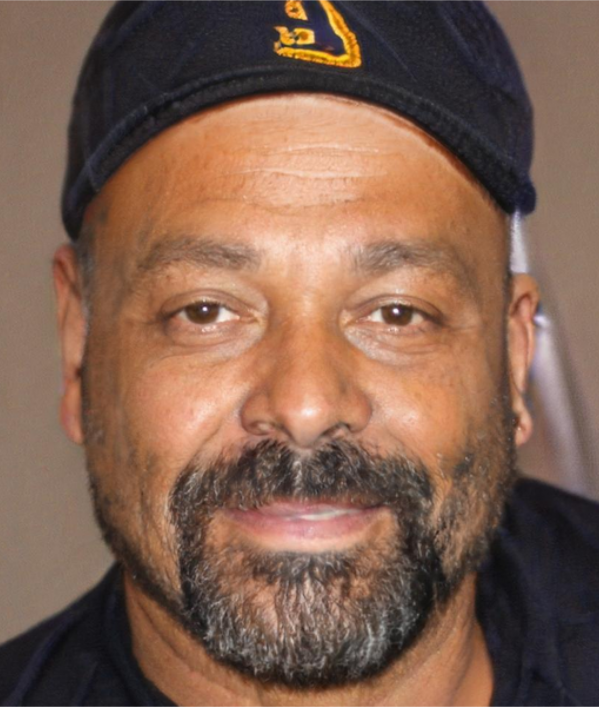

# Personas

# Introdução

Personas são personagens fictícios, arquétipo hipotéticos de um grupo de usuários reais, que é criada para descrever um usuário típico da aplicação. É
utilizada para representar um grupo de usuários finai, tendo em vista que são definidas principalmente por seus objetivos,
que são determinados num processo de refinamentos sucessivos durante a investigação inicial do domínio
de atividade do usuário e o domínio da aplicação [1]. 

## Metodologia

A criação das personas foi feita por meio do perfil do usuário do aplicativo que foi escolhido pelo grupo. Dessa forma,a metodologia utilizada para a criação das personas pelo grupo foi a utilização dos elementos característicos que devem ser utilizados para a definição de uma persona apontados por (BARBOSA; SILVA, 2021) [1].

Os elementos característicos utilizadas foram:

- **Identidade**: a persona deve possuir um nome e sobrenome, além de idade e outros dados demográficos que são significativos para a representação do usuário. É importante também, que ela possua uma foto.
- **Status**: deve-se definir que a persona é primária, secundária, stakeholder ou se é uma antipersona. 
- **Objetivos**: define-se os objetivos da persona. Pode também caracterizar objetivos que estejam fora do domínio da aplicação.
- **Habilidades**: define-se a especialidade, habilidades da persona em questão, como escolaridade, educação, treinamentos e competências. Pode também caracterizar habilidades que estejam fora do domínio da aplicação.
- **Tarefas**: descreve quais tarefas a persona realiza, com frequência de realização e duração. Importante detalhar como elas são realizadas para cada cenário.
- **Relacionamentos**: entendimento de com quem a persona se relaciona, em diversos âmbitos. Ajuda na identificação de outros stakeholders. 
- **Requisitos**: deve-se entender e descrever quais são as necessidades daquela persona, incluindo citações para relacionar mais com a realidade.
- **Expectativas**: descreve a expectativa da persona para com o produto. Como ela espera que ele funcione.

## Personas

A seguir, apresentamos o elenco de personas para o aplicativo em questão, tendo em vista, ele deve possuir de três a doze personas [1]. 

As imagens das personas foram geradas utilizando o site [This-Person-Does-not-Exist.com](https://this-person-does-not-exist.com/pt) [2].

### Persona Primária 1: Maria das Dores Silva (Aposentada)

  
<b>Figura 1: Foto de Maria das Dores Silva</b>

    

    

        <b>Fonte: <a href="https://thispersondoesnotexist.com/">This Person Does not Exist</a> , 2024</b>
    

 

**Nome: Maria das Dores Silva**

- **Idade:** 68 anos 
- **Gênero:** Feminino
- **Habilidades:** Possui habilidade em inglês, uma vez que foi professora por muitos anos. Crocheta e pinta panos por hobby.
- **Afinidade com tecnologia:** Média/baixa
- **Tarefa Primária:** Consultar o extrato de pagamentos todos os meses. 
- **Objetivo:** Maria é uma professora aposentada e todo mês, a companhia do seu plano de saúde solicita a comprovação de que a ela está recebendo aposentadoria para manter o seu plano ativo. Dessa forma, Maria utiliza o aplicativo do Meu INSS para consultar seu extrato de pagamento com frequência, além de outras funcionalidades quando necessário.
- **Relacionamentos:** Maria é casada, com duas filhas mulheres e três netos. Suas filhas moram em outro estado, então, fazem videochamadas todos os dias para conversarem com a mãe. Ela participa de um grupo de crochê semanal com suas amigas com a mesma faixa etária que a sua.
- **Requisitos:** Maria precisa de um aplicativo que seja intuitivo, simples e confiável. Ela preza que seus dados de aposentadoria sejam seguros e que seja fácil acessá-los quando necessário. 
- **Expectativas:** Maria espera que o aplicativo a ajude a realizar a consulta de seus extratos e a emissão de documentos necessários, para não ser preciso ir a uma agência do INSS para resolver seus problemas. Ela também espera que seja possível personalizar o aplicativo, bem como alterar o tamanho da fonte do texto e outras funcionalidades. 

### Persona Primária 2: Carlos Eduardo da Silva Ferreira (Autônomo)

  
<b>Figura 2: Foto de Carlos Eduardo da Silva Ferreira</b>

    

    

        <b>Fonte: <a href="https://thispersondoesnotexist.com/">This Person Does not Exist</a> , 2024</b>
    

 

**Nome: Carlos Eduardo da Silva Ferreira**

- **Idade:** 37 anos 
- **Gênero:** Masculino
- **Habilidades:** Carlos é técnico em eletrônica e trabalha como autônomo. Tem habilidades manuais e mecânicas.
- **Afinidade com tecnologia:** Média
- **Tarefa Primária:** Consultar seu histórico de contribuições, realizar/acompanhar de pedidos e verificar a previsão de aposentadoria.
- **Objetivo:** Como autônomo, Carlos precisa acompanhar regularmente se suas contribuições para o INSS estão em dia. Ele busca evitar problemas futuros com sua aposentadoria e garantir acesso a benefícios caso enfrente situações inesperadas, como afastamento por doença ou acidente.
- **Relacionamentos:** Carlos é casado e pai de dois filhos pequenos. Ele é o principal responsável financeiro da casa e preza pela estabilidade da sua família. Gosta de ajudar colegas autônomos que possuem dúvidas sobre o INSS, já que conhece um pouco do sistema.
- **Requisitos:** Carlos precisa de um aplicativo que permita fácil acesso ao histórico de contribuições, regularização de pendências e simulação de aposentadoria. Ele valoriza a possibilidade de realizar todos esses processos sem precisar ir a uma agência.
- **Expectativas:** Carlos espera que o aplicativo seja prático, confiável e permita visualizar claramente informações como os meses pagos e pendentes, além de fornecer alertas e notificações de prazos importantes. Ele também gostaria que o app oferecesse orientações simples para resolver pendências ou entender seus direitos como contribuinte.

### Persona Secundária 1:  Ana Carolina Rocha Barié (Assistente Administrativa)

  
<b>Figura 3: Foto de Ana Carolina Rocha Barié</b>

    

    

        <b>Fonte: <a href="https://thispersondoesnotexist.com/">This Person Does not Exist</a> , 2024</b>
    

 

**Nome: Ana Carolina Rocha Barié**

- **Idade:** 49 anos 
- **Gênero:** Feminino
- **Habilidades:** Graduação em ciências contábeis. Ela possui um bom conhecimento de informática, é organizada e tem experiência com documentos e processos burocráticos.
- **Afinidade com tecnologia:** Alta
- **Tarefa Primária:** Acompanhar e gerir os recolhimentos do INSS de seu marido (autônomo) e dos filhos (que trabalham como empregados na mesma empresa que ela), para garantir que todos estejam em dia e possam acessar benefícios futuros, como aposentadoria e auxílios diversos.
- **Objetivo:** Ana se preocupa em garantir que toda a sua família tenha as contribuições do INSS regularizadas, principalmente para evitar problemas com aposentadoria e para garantir direitos em situações como licença-maternidade e benefícios por incapacidade.
- **Relacionamentos:** Ana é casada com João, um trabalhador autônomo, e tem dois filhos, uma mulher de 25 anos e um homem de 23 anos. Ela tem uma boa rede de apoio familiar e frequentemente recebe orientações sobre o INSS de colegas de trabalho. Ana também se envolve em atividades de voluntariado e gosta de trocar experiências com pessoas de diferentes faixas etárias, sempre tentando ajudar a simplificar o que é burocrático e difícil.
- **Requisitos:** Ana precisa de um aplicativo que permita verificar as contribuições de sua família de maneira fácil e rápida, além de possibilitar o acesso a extratos, simulações e pendências. Ela valoriza a possibilidade de verificar diferentes informações de maneira integrada, sem ter que navegar em múltiplos sistemas, fazer ligações telefônicas ou precisar ir a uma agência do INSS.
- **Expectativas:** Ana espera que o aplicativo tenha uma interface amigável, com informações claras sobre eventuais erros ou que precisa ser feito para regularizar as contribuições. Ela também deseja funcionalidades como alertas sobre datas de vencimento, além de poder acessar históricos de pagamentos e extratos sem complicações e problemas por esquecimentos.

### Persona Secundária 2: Lucas Henrique Costa Silva (Estudante)

  
<b>Figura 4: Lucas Henrique Costa Silva</b>

    

    

        <b>Fonte: <a href="https://thispersondoesnotexist.com/">This Person Does not Exist</a> , 2024</b>
    

 

**Nome: Lucas Henrique Costa Silva**

- **Idade:** 18 anos 
- **Gênero:** Masculino
- **Habilidades:** Estudante no terceiro ano do ensino médio. Trabalha meio período em uma loja de eletrônicos como menor aprendiz. Possui grande habilidade em futebol, uma vez que pratica o esporte desde os 6 anos.
- **Afinidade com tecnologia:** Alta
- **Tarefa Primária:** Acompanhar as contribuições de aposentadoria de seu pai, já que ele ajuda a família com questões burocráticas e financeiras, principalmente quando o pai precisa de auxílio para verificar extratos ou regularizar pendências no Meu INSS, que geralmente é sempre que o pai utiliza o aplicativo.
- **Objetivo:** Lucas está começando a se envolver mais com a gestão das finanças da família e, como parte desse processo, ele ajuda o pai a manter as contribuições do INSS em dia. Lucas quer garantir que o pai, que está prestes a se aposentar, tenha todos os direitos garantidos e que não tenham imprevistos com relação a isso.
- **Relacionamentos:** Lucas é filho único e mora com seus pais. Seu pai, Sérgio, está próximo da aposentadoria e ele tem o papel de ajudar com tarefas administrativas em casa, como o acompanhamento de pagamentos e documentos importantes. Lucas também tem uma boa relação com a mãe, que o apoia nos estudos e na sua jornada para se tornar mais independente financeiramente. Lucas namora há 1 ano e tem um grande grupo de amigos, que se encontram, ao menos uma vez no mês.
- **Requisitos:** Lucas precisa de um aplicativo que seja fácil de usar, onde ele consiga visualizar rapidamente as contribuições do pai, verificar o extrato de pagamentos e se há pendências que precisem ser resolvidas. Ele quer uma plataforma com poucas complicações, mas que permita obter todas as informações necessárias sobre a aposentadoria de seu pai.
- **Expectativas:** Lucas espera que o aplicativo seja intuitivo, com informações claras sobre o status da aposentadoria do pai e que facilite a consulta ao extrato de contribuições e a simulações. Ele também gostaria de receber alertas sobre prazos e pendências, para poder agir rapidamente caso surja algum problema. Lucas espera que o aplicativo seja simples o suficiente para que ele, como adolescente, consiga gerenciar de maneira eficiente sem depender de muito suporte, para que assim, ele consiga efetivamente ajudar seu pai.

## Anti-Personas

Antipersonas descrevem usuários para qual o software não está sendo projetado, ou seja, não deve influenciar as decisões de projeto [1]. A seguir, apresentamos as antipersonas do app do Meu INSS.

### Anti-Persona 1: Enzo Marques Naves (Desenvolvedor Junior)

  
<b>Figura 5: Foto de Enzo Marques Naves</b>

    

    

        <b>Fonte: <a href="https://thispersondoesnotexist.com/">This Person Does not Exist </a> , 2024</b>
    

**Nome: Enzo Marques Naves**

- **Idade:** 25 anos
- **Gênero:** Masculino
- **Habilidades:** É graduado em Engenharia da Computação e possui habilidades avançadas em tecnologia, programação e matemática. Gosta de desenvolver aplicativos e jogos como hobby.
- **Afinidade com tecnologia :** Alta
- **Objetivo:** Enzo está começando sua carreira e já contribui para a previdência, mas não vê necessidade de consultar frequentemente informações sobre aposentadoria ou pensões, pois acredita que isso é algo para o futuro distante. Prefere aplicativos que sejam rápidos e dinâmicos, focados em otimizar seu tempo ou que sejam jogos.
- **Relacionamentos:** Enzo é solteiro, tem um grupo de amigos que compartilham interesses em tecnologia e games, e jogam RPG juntos. Passa a maior parte do tempo no trabalho ou em atividades sociais. 
- **Requisitos:** Enzo precisa de um aplicativo que seja ágil, com funcionalidades modernas e que ofereça integração com outras plataformas financeiras de investimentos. Ele valoriza inovações.
- **Expectativas:** Enzo espera que um aplicativo seja intuitivo e que facilite a realização de tarefas rápidas, visualização do valor do dólar. Não está interessado em personalização de interface, como tamanhos de fonte, pois não vê isso como relevante em sua vida atual. Enzo também não demonstra interesse e expectativas quanto ao aplicativo do Meu INSS.

### Anti-Persona 2: João Pereira de Souza (Aposentado) 

  
<b>Figura 6: Foto de João Pereira de Souza</b>

    

    

        <b>Fonte: <a href="https://thispersondoesnotexist.com/">This Person Does not Exist</a> , 2024</b>
    

 

**Nome: João Pereira de Souza**

- **Idade:** 68 anos
- **Gênero:** Masculino
- **Habilidades:** Possui ensino médio completo. Desde então, trabalhou com pesca durante a sua vida.
- **Afinidade com a tecnologia:** Baixa. Não utiliza smartphones e não gosta de tecnologia.
- **Objetivo:** João é um aposentado que prefere resolver suas questões relacionadas à aposentadoria e benefícios diretamente no INSS ou com ajuda de um contador. Ele acredita que as ferramentas digitais são complicadas e desnecessárias.
- **Relacionamentos:** João mora sozinho. Ele tem dois filhos que moram em estados diferentes e que o visitam esporadicamente. Seus vizinhos são seu principal círculo social, e ele gosta de conversar e jogar dominó na praça local, além de praticar pesca.
- **Requisitos:** João não se sente seguro ao navegar por aplicativos como o Meu INSS. Ele prefere ajuda presencial, acreditando que um funcionário do INSS pode atender melhor suas necessidades. Ele valoriza soluções que não exijam o uso de senhas, logins ou internet.
- **Expectativas:** João espera que o INSS mantenha o atendimento presencial eficiente e sem filas longas. Ele acredita que o aplicativo só beneficia quem entende de tecnologia e gostaria que houvesse mais suporte pessoal para pessoas que, como ele, não usam smartphones ou computadores. João também não demonstra interesse e expectativas quanto ao aplicativo do Meu INSS.

## Referências Bibliográficas

> [1]  Barbosa, S. D. J.; Silva, B. S. da; Silveira, M. S.; Gasparini, I.; Darin, T.; Barbosa, G. D. J. (2021) Interação Humano-Computador e Experiência do usuário. 8.2 Personas, p. 167-171. Autopublicação. ISBN: 978-65-00-19677-1.
> 
> [2] This Person Does not Exist. Disponivel em: <https://thispersondoesnotexist.com/>. Acesso em: 19/11/2024.
> 

## Histórico de versões 

|Versão|Data|Descrição|Autor|Revisor|
|:----:|----|---------|-----|:-------:|
|`1.0`|19/11/2024|Criação do documento. Adição de personas primárias e antipersonas|[Júlia Fortunato](https://github.com/julia-fortunato)|[Nicolas Bomfim](https://github.com/nickgehjk)|
|`1.0`|20/11/2024|Adição de personas secundárias|[Júlia Fortunato](https://github.com/julia-fortunato)|[Nicolas Bomfim](https://github.com/nickgehjk)|