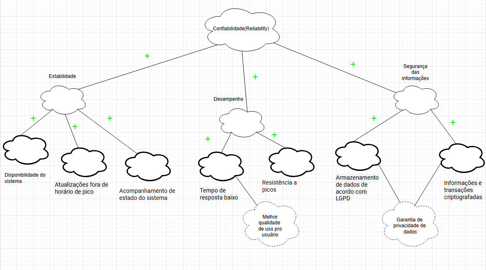
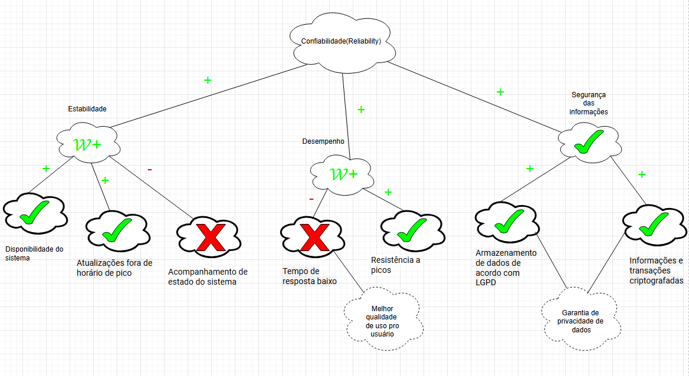
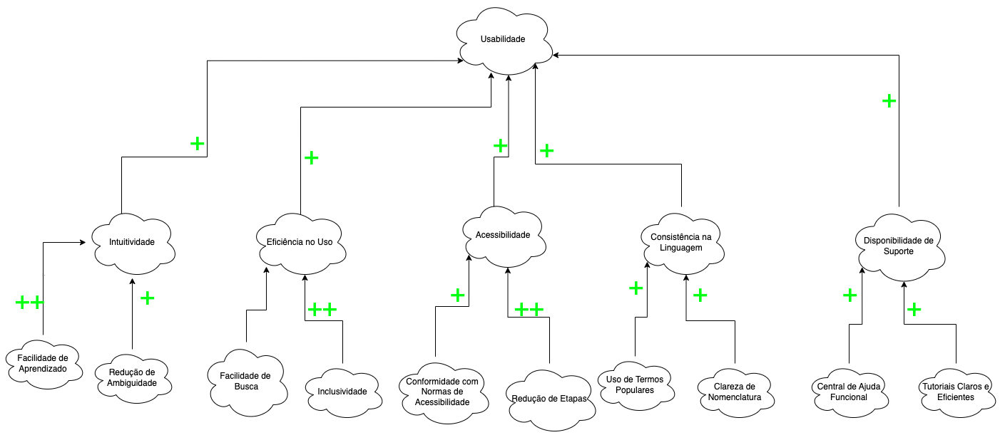
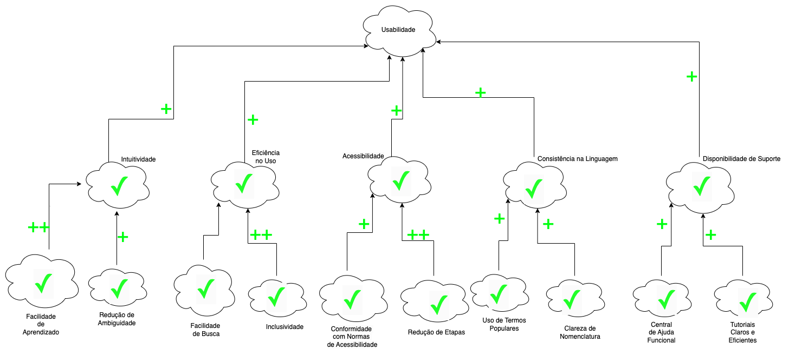
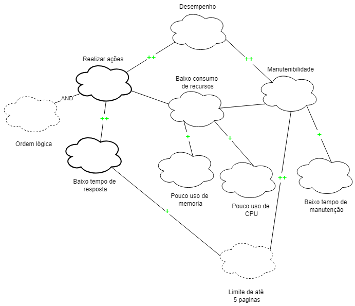
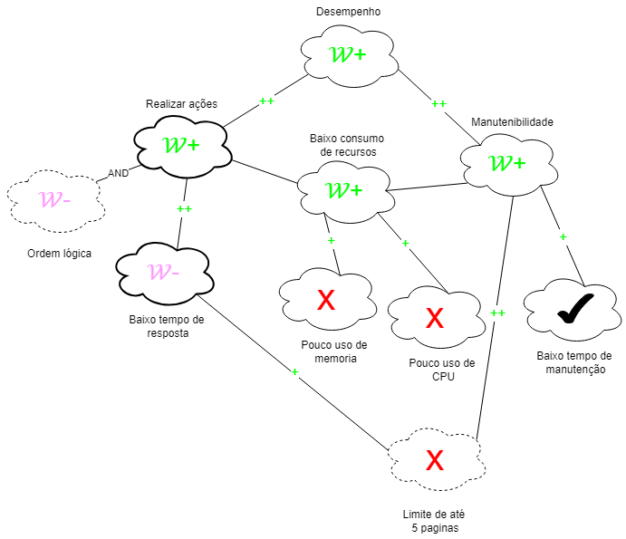

# NFR Framework

## Introdução

O NFR Framework (Framework de Requisitos Não Funcionais) é uma abordagem conceitual voltada para a modelagem e análise de requisitos não funcionais no contexto da Engenharia de Requisitos. Diferente dos requisitos funcionais, que descrevem o que o sistema faz, os requisitos não funcionais focam em características de qualidade como desempenho, segurança, usabilidade e confiabilidade, sendo considerados elementos fundamentais para o sucesso de um projeto.

O NFR Framework utiliza o Softgoal Interdependency Graph (SIG), um modelo que organiza os softgoals, ou seja, objetivos abstratos sem critérios rígidos de satisfação. No SIG, os softgoals são analisados e conectados por meio de decomposições e contribuições, que ajudam a entender como diferentes requisitos interagem e impactam o sistema.

Principais conceitos do NFR Framework: 

- NFR Softgoal: Representa os requisitos não funcionais como atributos de qualidade do sistema, podendo estar interrelacionados de forma orgânica e hierarquica na produção de um projeto. 
- Operationalizing Softgoal: Refere-se às implementações concretas que atendem aos softgoals como, por exemplo, processos e operações. 
- Claim Softgoal: Argumentações que justificam decisões no modelo. 
- Contribuições: Relacionamentos entre softgoals, podendo ser positivos (MAKE, HELP), negativos (HURT, BREAK) ou neutros (UNKNOWN). 
- Labels: Indicadores de satisfação dos softgoals, como Satisficed (atendido) ou Denied (negado).

O NFR Framework é essencial para gerenciar conflitos e avaliar alternativas, permitindo uma visão estruturada dos objetivos de qualidade do sistema e facilitando a tomada de decisões ao longo do desenvolvimento​. Na figura 1 abaixo é possível observar as simbologias utilizadas para a diferenciação dos tipos de softgoals e na figura 2 as simbologias usadas para a rotulagem dos softgoals:

  
<b>Figura 1: Tipos de Softgoals </b>

  <b>Fonte: SILVA, 2019
  </b>

  

  
<b>Figura 2: Rótulos para softgoals </b>

  <b>Fonte: SILVA, 2019
  </b>

## Metodologia

A criação do Softgoal Interdependency Graph (SIG) segue um processo estruturado, baseado na especificação suplementar do projeto. Inicialmente, os requisitos não funcionais (NFRs) são definidos com base no modelo FURPS+, sendo ajustados para alinhar com as categorias de qualidade estabelecidas.

Para cada categoria, são elaborados um SIG, um diagrama de propagação de impactos e um cartão de especificação, que contém informações detalhadas sobre o NFR, como sua descrição, categoria, conflitos, origem, critérios e outros aspectos relevantes. Foi utilizada a ferramenta Draw.io para criar os gráficos, e validações são realizadas por meio de revisões críticas para garantir a precisão e clareza dos requisitos.

## Cartões de especificação

Os cartões de especificação desempenham um papel fundamental na rastreabilidade e no desenvolvimento posterior do NFR, servindo como uma base estruturada. Os cartões apresentados nas Tabelas 1 a 8 foram utilizados para descrever os Requisitos Não-Funcionais necessários à elaboração dos NFR frameworks.

**Tabela 1** - Cartão de especificação: RNF01 - Usabilidade.

| **Campo**                 | **Detalhes**                                                                                                                                                                                                                                                                                                                                                                                                                                                                                                                                                            |
| ------------------------- | ----------------------------------------------------------------------------------------------------------------------------------------------------------------------------------------------------------------------------------------------------------------------------------------------------------------------------------------------------------------------------------------------------------------------------------------------------------------------------------------------------------------------------------------------------------------------- |
| **ID**                    | [CE01](https://requisitos-de-software.github.io/2024.2-MeuINSS/modelagem_parte2/nfr/#nfr03-usabilidade)                                                                                                                                                                                                                                                                                                                      |
| **Classificação**         | Usabilidade                                                                                                                                                                                                                                                                                                                                                                                                                                                                                                                                                             |
| **Descrição**             | O aplicativo deve ser intuitivo no uso.                                                                                                                                                                                                                                                                                                                                                                                                                                                                                                                                 |
| **Justificativa**         | Oferecer facilidade nas funcionalidades do sistema.                                                                                                                                                                                                                                                                                                                                                                                                                                                                                                                     |
| **Origem do Requisito**   | [Encenação](https://requisitos-de-software.github.io/2024.2-MeuINSS/elicitacao/encenacao/#nao-funcionais:~:text=Funcionais-,N%C3%A3o%20funcionais,-Refer%C3%AAncias%20Bibliogr%C3%A1ficas), [Entrevista](https://requisitos-de-software.github.io/2024.2-MeuINSS/elicitacao/entrevista/#nao-funcionais:~:text=Funcionais-,N%C3%A3o%20funcionais,-Bibliografia) , [Observação](https://requisitos-de-software.github.io/2024.2-MeuINSS/elicitacao/observacao/#:~:text=Requisitos%20Funcionais-,Requisitos%20N%C3%A3o%20Funcionais,-Refer%C3%AAncia%20bibliogr%C3%A1fica) |
| **Critério de Aceitação** | O aplicativo deve concluir tarefas em no maximo 5 cliques.                                                                                                                                                                                                                                                                                                                                                                                                                                                                                                              |
| **Dependências**          | Nenhuma                                                                                                                                                                                                                                                                                                                                                                                                                                                                                                                                                                 |
| **Prioridade**            | Alta                                                                                                                                                                                                                                                                                                                                                                                                                                                                                                                                                                    |
| **Conflitos**             | Nenhum identificado.                                                                                                                                                                                                                                                                                                                                                                                                                                                                                                                                                    |
| **História**              | 17/12/2024                                                                                                                                                                                                                                                                                                                                                                                                                                                                                                                                                              |

Autor: [Mauricio Ferreira](https://github.com/mauricio-araujoo), 2024

**Tabela 2** - Cartão de especificação: RNF02 - Usabilidade.

| **Campo**                 | **Detalhes**                                                                                                                                                                                                                                                                                                                                                                                                                                                                                                                                                            |
| ------------------------- | ----------------------------------------------------------------------------------------------------------------------------------------------------------------------------------------------------------------------------------------------------------------------------------------------------------------------------------------------------------------------------------------------------------------------------------------------------------------------------------------------------------------------------------------------------------------------- |
| **ID**                    | [CE02](https://requisitos-de-software.github.io/2024.2-MeuINSS/modelagem_parte2/nfr/#nfr03-usabilidade)                                                                                                                                                                                                                                                                                                                      |
| **Classificação**         | Usabilidade                                                                                                                                                                                                                                                                                                                                                                                                                                                                                                                                                             |
| **Descrição**             | O aplicativo deve possuir tutoriais explicativos de uso (por exemplo, vídeos, FAQs).                                                                                                                                                                                                                                                                                                                                                                                                                                                                                    |
| **Justificativa**         | Oferecer suporte imediato ao usuário, facilitando o entendimento das funcionalidades do sistema.                                                                                                                                                                                                                                                                                                                                                                                                                                                                        |
| **Origem do Requisito**   | [Encenação](https://requisitos-de-software.github.io/2024.2-MeuINSS/elicitacao/encenacao/#nao-funcionais:~:text=Funcionais-,N%C3%A3o%20funcionais,-Refer%C3%AAncias%20Bibliogr%C3%A1ficas), [Entrevista](https://requisitos-de-software.github.io/2024.2-MeuINSS/elicitacao/entrevista/#nao-funcionais:~:text=Funcionais-,N%C3%A3o%20funcionais,-Bibliografia) , [Observação](https://requisitos-de-software.github.io/2024.2-MeuINSS/elicitacao/observacao/#:~:text=Requisitos%20Funcionais-,Requisitos%20N%C3%A3o%20Funcionais,-Refer%C3%AAncia%20bibliogr%C3%A1fica) |
| **Critério de Aceitação** | Disponibilização de tutoriais (vídeos ou FAQs) acessíveis na interface principal.                                                                                                                                                                                                                                                                                                                                                                                                                                                                                       |
| **Dependências**          | Nenhuma                                                                                                                                                                                                                                                                                                                                                                                                                                                                                                                                                                 |
| **Prioridade**            | Alta                                                                                                                                                                                                                                                                                                                                                                                                                                                                                                                                                                    |
| **Conflitos**             | Nenhum identificado.                                                                                                                                                                                                                                                                                                                                                                                                                                                                                                                                                    |
| **História**              | 17/12/2024                                                                                                                                                                                                                                                                                                                                                                                                                                                                                                                                                              |

Autor: [Ana Catarina Santos](https://github.com/an4catarina), 2024

**Tabela 3** - Cartão de especificação: RNF03 - Usabilidade.

| **Campo**                 | **Detalhes**                                                                                                                                                                                                                                       |
| ------------------------- | -------------------------------------------------------------------------------------------------------------------------------------------------------------------------------------------------------------------------------------------------- |
| **ID**                    | [CE03](https://requisitos-de-software.github.io/2024.2-MeuINSS/modelagem_parte2/nfr/#nfr03-usabilidade) |
| **Classificação**         | Usabilidade                                                                                                                                                                                                                                        |
| **Descrição**             | O aplicativo deve possuir uma central de ajuda clara.                                                                                                                                                                                              |
| **Justificativa**         | Melhorar o suporte ao usuário e resolver dúvidas de forma prática e eficiente.                                                                                                                                                                     |
| **Origem do Requisito**   | [Encenação](https://requisitos-de-software.github.io/2024.2-MeuINSS/elicitacao/encenacao/#nao-funcionais:~:text=Funcionais-,N%C3%A3o%20funcionais,-Refer%C3%AAncias%20Bibliogr%C3%A1ficas)                                                         |
| **Critério de Aceitação** | Central de ajuda deve conter tópicos claros, organizados por categoria e ser fácil de navegar.                                                                                                                                                     |
| **Dependências**          | Nenhuma                                                                                                                                                                                                                                            |
| **Prioridade**            | Média                                                                                                                                                                                                                                              |
| **Conflitos**             | Nenhum identificado.                                                                                                                                                                                                                               |
| **História**              | Inserido após observação de dúvidas recorrentes nos testes com usuários.                                                                                                                                                                           |

Autor: [Mauricio Ferreira](https://github.com/mauricio-araujoo), 2024

**Tabela 4** - Cartão de especificação: RNF04 - Usabilidade.

| **Campo**                 | **Detalhes**                                                                                                                                                                                                                                                                                                                                                   |
| ------------------------- | -------------------------------------------------------------------------------------------------------------------------------------------------------------------------------------------------------------------------------------------------------------------------------------------------------------------------------------------------------------- |
| **ID**                    | [CE04](https://requisitos-de-software.github.io/2024.2-MeuINSS/modelagem_parte2/nfr/#nfr03-usabilidade)                                                                                                             |
| **Classificação**         | Usabilidade                                                                                                                                                                                                                                                                                                                                         |
| **Descrição**             | O aplicativo deve facilitar a execução de tarefas.                                                                                                                                                                                                                                                                                                             |
| **Justificativa**         | Oferecer facilidade nas funcionalidades do sistema.                                                                                                                                                                                                                                                                                                            |
| **Origem do Requisito**   | [Encenação](https://requisitos-de-software.github.io/2024.2-MeuINSS/elicitacao/encenacao/#nao-funcionais:~:text=Funcionais-,N%C3%A3o%20funcionais,-Refer%C3%AAncias%20Bibliogr%C3%A1ficas), [Entrevista](https://requisitos-de-software.github.io/2024.2-MeuINSS/elicitacao/entrevista/#nao-funcionais:~:text=Funcionais-,N%C3%A3o%20funcionais,-Bibliografia) |
| **Critério de Aceitação** | O sistema deve ter um tempo de resposta em suas funcionalidades inferior a 300ms.                                                                                                                                                                                                                   |
| **Dependências**          | Nenhuma                                                                                                                                                                                                                                                                                                                                                        |
| **Prioridade**            | Alta                                                                                                                                                                                                                                                                                                                                                           |
| **Conflitos**             | Nenhum identificado.                                                                                                                                                                                                                                                                                                                                           |
| **História**              | 17/12/2024                                                                                                                                                                                                                                                                                                                                                     |

Autor: [Mauricio Ferreira](https://github.com/mauricio-araujoo), 2024

**Tabela 5** - Cartão de especificação: RNF05 - Usabilidade.

| **Campo**                 | **Detalhes**                                                                                                                                                                                                                                       |
| ------------------------- | -------------------------------------------------------------------------------------------------------------------------------------------------------------------------------------------------------------------------------------------------- |
| **ID**                    | [CE05](https://requisitos-de-software.github.io/2024.2-MeuINSS/modelagem_parte2/nfr/#nfr03-usabilidade) |
| **Classificação**         | Usabilidade                                                                                                                                                                                                                                        |
| **Descrição**             | O aplicativo deve possuir, além de termos técnicos, nomenclaturas populares para as funcionalidades do INSS.                                                                                                                                       |
| **Justificativa**         | Facilitar o entendimento das funcionalidades por diferentes públicos.                                                                                                                                                                              |
| **Origem do Requisito**   | [Entrevista](https://requisitos-de-software.github.io/2024.2-MeuINSS/elicitacao/entrevista/#nao-funcionais:~:text=Funcionais-,N%C3%A3o%20funcionais,-Bibliografia)                                                                                 |
| **Critério de Aceitação** | Uso de termos populares nas descrições e labels das funcionalidades.                                                                                                                                                                               |
| **Dependências**          | Nenhuma                                                                                                                                                                                                                                            |
| **Prioridade**            | Alta                                                                                                                                                                                                                                               |
| **Conflitos**             | Possível conflito entre precisão técnica e clareza popular.                                                                                                                                                                                        |
| **História**              | 17/12/2024                                                                                                                                                                                                                                         |

Autor: [Ana Catarina Santos](https://github.com/an4catarina), 2024

**Tabela 6** - Cartão de especificação: RNF11 - Confiabilidade.

| **Campo**                 | **Detalhes**                                                                                                                                                                                                                                       |
| ------------------------- | -------------------------------------------------------------------------------------------------------------------------------------------------------------------------------------------------------------------------------------------------- |
| **ID**                    | [CE06](https://requisitos-de-software.github.io/2024.2-MeuINSS/modelagem_parte2/nfr/#nfr02-confiabilidade) |
| **Classificação**         | Confiabilidade                                                                                                                                                                                                                                          |
| **Descrição**             | O aplicativo deve armazenar dados em conformidade com a LGPD (Lei Geral de Proteção de Dados).                                                                                                                                                     |
| **Justificativa**         | Garantir segurança e privacidade no tratamento e armazenamento dos dados dos usuários, cumprindo requisitos legais.                                                                                                                                |
| **Origem do Requisito**   | [Glossário](<https://requisitos-de-software.github.io/2024.2-MeuINSS/elicitacao/glossario/#requisitos-nao-funcionais-rnf:~:text=Requisitos%20Funcionais%20(RF)-,Requisitos%20N%C3%A3o%20Funcionais%20(RNF),-Bibliografia>)                         |
| **Critério de Aceitação** | Realização de auditorias de conformidade com a LGPD e testes de segurança.                                                                                                                                                                         |
| **Dependências**          | Nenhuma                                                                                                                                                                                                                                            |
| **Prioridade**            | Média                                                                                                                                                                                                                                              |
| **Conflitos**             | Pode haver impactos em sistemas legados ou aumento de custos para implementação.                                                                                                                                                                   |
| **História**              | 17/12/2024                                                                                                                                                                                                                                         |

Autor: [Ana Catarina Santos](https://github.com/an4catarina), 2024

**Tabela 7** - Cartão de especificação: RNF12 - Confiabilidade.

| **Campo**                 | **Detalhes**                                                                                                                                                                                                                                       |
| ------------------------- | -------------------------------------------------------------------------------------------------------------------------------------------------------------------------------------------------------------------------------------------------- |
| **ID**                    | [CE07](https://requisitos-de-software.github.io/2024.2-MeuINSS/modelagem_parte2/nfr/#nfr02-confiabilidade) |
| **Classificação**         | Confiabilidade                                                                                                                                                                                                                                     |
| **Descrição**             | O sistema deve estar disponível para o usuário por no mínimo 99% do tempo de um mês, exceto em momentos de manutenção programada.                                                                                                                  |
| **Justificativa**         | Garantir alta disponibilidade do sistema para atender às necessidades dos usuários de forma contínua.                                                                                                                                              |
| **Origem do Requisito**   | [Observação](https://requisitos-de-software.github.io/2024.2-MeuINSS/elicitacao/observacao/#:~:text=Requisitos%20Funcionais-,Requisitos%20N%C3%A3o%20Funcionais,-Refer%C3%AAncia%20bibliogr%C3%A1fica)                                             |
| **Critério de Aceitação** | Relatório de disponibilidade mensal comprovando um tempo de uptime igual ou superior a 99%, descontando as manutenções programadas.                                                                                                                |
| **Dependências**          | Nenhuma                                                                                                                                                                                                                                            |
| **Prioridade**            | Média                                                                                                                                                                                                                                              |
| **Conflitos**             | Manutenção programada pode impactar o uso durante janelas específicas.                                                                                                                                                                             |
| **História**              | 17/12/2024                                                                                                                                                                                                                                         |

Autor: [Ana Catarina Santos](https://github.com/an4catarina), 2024

**Tabela 8** - Cartão de especificação: Suportabilidade

| **Campo**                 | **Detalhes**                                                                                                                                                                                                                                                                                                                                                                                                                                                                                                                                                                     |
| ------------------------- | -------------------------------------------------------------------------------------------------------------------------------------------------------------------------------------------------------------------------------------------------------------------------------------------------------------------------------------------------------------------------------------------------------------------------------------------------------------------------------------------------------------------------------------------------------------------------------- |
| **ID**                    | [CE08](https://requisitos-de-software.github.io/2024.2-MeuINSS/modelagem_parte2/nfr/#nfr01-suportabilidade)                                                                                                                                                                                                                                                                                                                                   |
| **Classificação**         | Suportabilidade                                                                                                                                                                                                                                                                                                                                                                                                                                                                                                                                                                  |
| **Descrição**             | O sistema deve permitir a fácil atualização, monitoramento contínuo, diagnóstico de problemas e rastreabilidade de alterações, garantindo a manutenção e evolução ao longo do tempo.                                                                                                                                                                                                                                                                                                                                                                                             |
| **Justificativa**         | Assegurar que o sistema seja de fácil manutenção, permitindo adaptações e melhorias contínuas com mínimo impacto ao serviço.                                                                                                                                                                                                                                                                                                                                                                                                                                                     |
| **Origem do Requisito**   | [Observação](https://requisitos-de-software.github.io/2024.2-MeuINSS/elicitacao/observacao/#:~:text=Requisitos%20Funcionais-,Requisitos%20N%C3%A3o%20Funcionais,-Refer%C3%AAncia%20bibliogr%C3%A1fica), [Entrevista](https://requisitos-de-software.github.io/2024.2-MeuINSS/elicitacao/entrevista/#nao-funcionais), [Encenação](https://requisitos-de-software.github.io/2024.2-MeuINSS/elicitacao/encenacao/#nao-funcionais) e [Especificação suplementar](https://requisitos-de-software.github.io/2024.2-MeuINSS/modelagem_parte1/especificacaosuplementar/#suportabilidade) |
| **Critério de Aceitação** | Comprovação de facilidade na aplicação de atualizações (testes automáticos) e geração de relatórios com logs contínuos que demonstram rastreabilidade e diagnóstico eficiente de problemas                                                                                                                                                                                                                                                                                                                                                                                       |
| **Dependências**          | Foram identidicadas apenas interdependências entre os softgoals                                                                                                                                                                                                                                                                                                                                                                                                                                                                                                                  |
| **Prioridade**            | Alta                                                                                                                                                                                                                                                                                                                                                                                                                                                                                                                                                                             |
| **Conflitos**             | Não foram identificados conflitos                                                                                                                                                                                                                                                                                                                                                                                                                                                                                                                                                |
| **História**              | 17/12/2024                                                                                                                                                                                                                                                                                                                                                                                                                                                                                                                                                                       |

Autor: [Júlia Fortunato](https://github.com/julia-fortunato), 2024

## NFR Framework

### NFR01 - Suportabilidade

A suportabilidade se mostra de total importância para um sistema, uma vez que, tem-se os requisitos que estão relacionados ao suporte e manutenção da aplicação, que inevitavelmente, garantem a facilidade de manutenção e evolução do sistema ao longo do tempo, tornando-o mais robusto. Além disso, a suportabilidade trata de atualizações do sistema, problemas e erros e monitoramento e rastreabilidade do Meu INSS.

#### **Softgoal Interdependency Graph - Suportabilidade**

Na figura 3, está disponível o gráfico, Softgoal Interdependency Graph, para o softgoal Suportabilidade.

  
<b>Figura 3:</b> Softgoal Interdependency Grap de Suportabilidade 

  Autor: <a href="https://github.com/julia-fortunato">Júlia Fortunato</a>, 2024
  

#### **Propagação de impactos - Suportabilidade**  

Na figura 4, tem-se a propagação de impactos do SIG para suportabilidade.

  
<b>Figura 4:</b> Propagação de Impacto Softgoal Interdependency Graph de Suportabilidade 

  Autor: <a href="https://github.com/julia-fortunato">Júlia Fortunato</a>, 2024

### NFR02 - Confiabilidade

A parte da "Confiabilidade" de um determinado aplicativo é um atributo essencial no que tange à sua capacidade de funcionar de maneira estável como também de forma contínua e sem apresentar perdas parciais ou totais no funcionamento. Esse aspecto tem a função de assegurar aos usuários que o aplicativo estará disponibilizado e operando sempre que seu uso for necessário. A confiabilidade é de suma importância para tornar uma experiência positiva, garantir que não ocorra eventuais erros ou também interrupções e para zelar pela reputação do software. Podemos citar a "Ajuda e Documentação" como ferramentas importantes para ajudar os usuários do software, a confiabilidade serve como a base que fortalece a confiança deles no aplicativo, permitindo que utilizem as informações de suporte de maneira segura e com eficiência.  

#### **Softgoal Interdependency Graph**  

É possível ver o Softgoal Interdependency Graph do softgoal "Confiabilidade (Reliability)" demonstrado através da figura 5.

  
<b>Figura 5: Softgoal Interdependency Grap de Confiabilidade(Reliability) </b>

  <b>Autor: <a href="https://github.com/CristianoMoraiss">Cristiano Morais, 2024</a>
  </b>

#### **Propagação de impactos**  

Pode-se observar a propagação de impacto do softgoal Confiabilidade através da figura 5.

  
<b>Figura 5: Propagação de Impacto Softgoal Interdependency Graph de Confiabilidade(Reliability) </b>

  <b>Autor: <a href="https://github.com/CristianoMoraiss">Cristiano Morais, 2024</a>
  </b>

### NFR03 - Usabilidade

A usabilidade de uma aplicação é crucial para garantir que os usuários possam interagir com o sistema de forma eficiente e satisfatória. Aplicações com boa usabilidade possuem interfaces intuitivas, que facilitam o aprendizado e a execução de tarefas, reduzindo erros e aumentando a satisfação do usuário.

Uma boa usabilidade melhora a experiência do usuário, tornando o sistema mais acessível e competitivo no mercado. Isso resulta em maior produtividade e confiança por parte dos usuários. Por isso, a otimização contínua da usabilidade deve ser uma prioridade durante o desenvolvimento e manutenção da aplicação, garantindo uma experiência fluida e eficiente.

#### **Softgoal Interdependency Graph - Usabilidade**  

É possível ver o Softgoal Interdependency Grap do softgoal "Usabilidade" demonstrado através da figura 6.

  
<b>Figura 6: Softgoal Interdependency Graph de Usabilidade </b>

  <b>Autores: <a href="https://github.com/an4catarina">Ana Catarina, </a>
  <a href="https://github.com/nickgehjk">Nicolas Bomfim. 2024 </a>
  </b>

#### **Propagação de impactos - Usabilidade**  

Pode-se observar a propagação de impacto do softgoal Usabilidade através da figura 7.

  
<b>Figura 7: Propagação de Impacto Softgoal Interdependency Graph de Usabilidade</b>

  <b>Autores: <a href="https://github.com/an4catarina">Ana Catarina, </a>
  <a href="https://github.com/nickgehjk">Nicolas Bomfim. 2024 </a>
  </b>

### NFR04 - Desempenho

O desempenho de uma aplicação é um fator crucial para garantir a execução de tarefas de forma eficaz, eficiente e com o uso otimizado dos recursos do sistema. Uma aplicação com bom desempenho apresenta tempos de resposta reduzidos, utilização eficiente da CPU, memória e demais recursos computacionais, além de oferecer uma experiência estável e consistente ao usuário, mesmo sob condições de carga elevada.

Além de contribuir para a produtividade, o desempenho impacta diretamente a satisfação do usuário final, tornando a aplicação mais confiável e competitiva no mercado. Aplicações com baixo tempo de resposta e uso eficiente de recursos garantem um funcionamento mais rápido, consomem menos energia em dispositivos e servidores, e reduzem custos operacionais. Por isso, a otimização contínua do desempenho deve ser prioridade durante o desenvolvimento, testes e manutenção, visando sempre alcançar um equilíbrio entre eficiência, estabilidade e experiência do usuário.

#### **Softgoal Interdependency Graph - Desempenho**  

É possível ver o Softgoal Interdependency Grap do softgoal "Desempenho (Performance)" demonstrado através da figura 8.

  
<b>Figura 8: Softgoal Interdependency Graph de Desempenho(Performance) </b>

  <b>Autor: <a href="https://github.com/mauricio-araujoo">Mauricio Ferreira, 2024</a>
  </b>

#### **Propagação de impactos - Desempenho**  

Pode-se observar a propagação de impacto do softgoal Desempenho através da figura 7.

  
<b>Figura 7: Softgoal Interdependency Graph de Desempenho(Performance) </b>

  <b>Autor: <a href="https://github.com/mauricio-araujoo">Mauricio Ferreira, 2024</a>
  </b>

## Referência bibliográfica

> [1] SAYÃO, M.; DE CARVALHO, G. Construção do léxico de aplicações. 4th Workshop in Information and Human Language Technology (TIL’2006). 2006. Disponível em: <http://www.nilc.icmc.usp.br/til/til2006/0030.pdf>. Acesso em: 03 dez. 2024.
> [2] SILVA, Reinaldo Antônio. NFR4ES: Um Catálogo de Requisitos Não-Funcionais para Sistemas Embarcados. Centro de Informática UFPE, Recife, 2019. Disponível em: https://repositorio.ufpe.br/handle/123456789/34150. Acesso em: 17/12/2024.

## Bibliografia

> SERRANO, Milene; SERRANO, Maurício. Requisitos - Aula 17. s.d. Disponível em: <https://aprender3.unb.br/pluginfile.php/2972516/mod_resource/content/1/Requisitos%20-%20Aula%20019a.pdf>. Acesso em: 17 dez. 2024.

## Histórico de Versões

| Versão | Data       | Descrição            | Autor                   |         Revisor         |
| :----: | ---------- | -------------------- | ----------------------- | :---------------------: |
| `1.0`  | 11/12/2024 | Criação do documento e adição dos cartões de especificação | [Ana Catarina Santos](https://github.com/an4catarina) |[Nicolas Bomfim](https://github.com/nickgehjk)|
