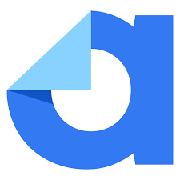
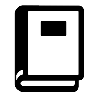
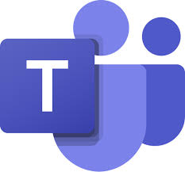

# Ferramentas Utilizadas

## Introdução

Esta seção apresenta as ferramentas adotadas ao longo do desenvolvimento do projeto, com o intuito de facilitar e centralizar as atividades da equipe. A Tabela 1 lista todas as ferramentas, detalhando suas funcionalidades, incluindo sistemas e plataformas que auxiliam tanto no desenvolvimento quanto na coordenação das atividades da equipe.

<b>Tabela 1</b> - Ferramentas utilizadas pela equipe

  <table>
    <thead>
      <tr>
        <th>Logo</th>
        <th>Ferramenta</th>
        <th>Finalidade</th>
      </tr>
    </thead>
    <tbody>
      <tr>
        <td></td>
        <td><a href="https://www.autentique.com.br/">Autentique</a></td>
        <td>Ferramenta para assinatura e organização de contratos.</td>
      </tr>
      <tr>
        <td></td>
        <td><a href="https://www.canva.com/">Canva</a></td>
        <td>Plataforma para design e criação de gráficos e diagramas, como o Rich Picture.</td>
      </tr>
      <tr>
        <td></td>
        <td><a href="https://www.google.com/docs/about/">Google Docs</a></td>
        <td>Editor de texto para criação e revisão de documentos.</td>
      </tr>
      <tr>
        <td></td>
        <td><a href="https://github.com/">GitHub</a></td>
        <td>Plataforma de versionamento de código e armazenamento de documentos do projeto.</td>
      </tr>
      <tr>
        <td></td>
        <td><a href="https://www.mkdocs.org/">MkDocs</a></td>
        <td>Ferramenta para criar e manter a documentação de forma prática e organizada.</td>
      </tr>
      <tr>
        <td></td>
        <td><a href="https://www.google.com/sheets/about/">Google Sheets</a></td>
        <td>Ferramenta para organização e controle de cronogramas e tarefas.</td>
      </tr>
      <tr>
        <td></td>
        <td><a href="https://www.microsoft.com/en/microsoft-teams/group-chat-software">Microsoft Teams</a></td>
        <td>Plataforma de comunicação para reuniões em equipe, compartilhamento de informações e gravação das apresentações.</td>
      </tr>
      <tr>
        <td></td>
        <td><a href="https://code.visualstudio.com/">Visual Studio Code</a></td>
        <td>Ambiente de desenvolvimento integrado (IDE) para edição de código e arquivos de documentação.</td>
      </tr>
      <tr>
        <td></td>
        <td><a href="https://www.whatsapp.com/">WhatsApp</a></td>
        <td>Ferramenta de mensagens para comunicação rápida entre os membros da equipe.</td>
      </tr>
      <tr>
        <td></td>
        <td><a href="https://www.youtube.com/">YouTube</a></td>
        <td>Plataforma de hospedagem de vídeos, utilizada para compartilhar apresentações e vídeos técnicos.</td>
      </tr>
      <tr>
        <td></td>
        <td><a href="https://www.figma.com/">Figma</a></td>
        <td>Ferramenta para criação de protótipos de alta fidelidade.</td>
      </tr>
    </tbody>
  </table>

  
<b>Autor:</b> <a href="https://github.com/an4catarina">Ana Catarina Santos</a>, 2024

## Referências Bibliográficas

1. AUTENTIQUE. _Autentique_. Disponível em: [https://www.autentique.com.br/](https://www.autentique.com.br/). Acesso em: 2 nov. 2024.
2. CANVA. _Canva_. Disponível em: [https://www.canva.com/](https://www.canva.com/). Acesso em: 2 nov. 2024.
3. GOOGLE. _Google Docs_. Disponível em: [https://www.google.com/docs/about/](https://www.google.com/docs/about/). Acesso em: 2 nov. 2024.
4. GITHUB. _GitHub_. Disponível em: [https://github.com/](https://github.com/). Acesso em: 2 nov. 2024.
5. MKDOCS. _MkDocs_. Disponível em: [https://www.mkdocs.org/](https://www.mkdocs.org/). Acesso em: 2 nov. 2024.
6. GOOGLE. _Google Sheets_. Disponível em: [https://www.google.com/sheets/about/](https://www.google.com/sheets/about/). Acesso em: 2 nov. 2024.
7. MICROSOFT. _Microsoft Teams_. Disponível em: [https://www.microsoft.com/en/microsoft-teams/group-chat-software](https://www.microsoft.com/en/microsoft-teams/group-chat-software). Acesso em: 2 nov. 2024.
8. MICROSOFT. _Visual Studio Code_. Disponível em: [https://code.visualstudio.com/](https://code.visualstudio.com/). Acesso em: 2 nov. 2024.
9. META. _WhatsApp_. Disponível em: [https://www.whatsapp.com/](https://www.whatsapp.com/). Acesso em: 2 nov. 2024.
10. GOOGLE. _YouTube_. Disponível em: [https://www.youtube.com/](https://www.youtube.com/). Acesso em: 2 nov. 2024.
10. Figma. Disponível em: [https://www.figma.com/](https://www.figma.com/). Acesso em: 2 nov. 2024.

## Bibliografia

1. MELO, Arthur de; HENRIQUE, Matheus. _Ferramentas - Bilheteria Digital_. Disponível em: [https://www.bilheteriadigital.com/ferramentas](https://www.bilheteriadigital.com/ferramentas). Acesso em: 2 nov. 2024.

 

## Histórico de Versões

  <table>
    <thead>
      <tr>
        <th>Versão</th>
        <th>Data</th>
        <th>Descrição</th>
        <th>Autor</th>
        <th>Revisor</th>
      </tr>
    </thead>
    <tbody>
      <tr>
        <td>1.0</td>
        <td>02/11/2024</td>
        <td>Criação e formação do documento</td>
        <td><a href="https://github.com/an4catarina">Ana Catarina Santos</a></td>
        <td><a href="https://github.com/julia-fortunato">Júlia Fortunato</a></td>
      </tr>
      <tr>
        <td>1.1</td>
        <td>10/02/2025</td>
        <td>Adição da ferramenta figma</td>
        <td><a href="https://github.com/an4catarina">Ana Catarina Santos</a></td>
        <td><a href="https://github.com/julia-fortunato">Júlia Fortunato</a></td>
      </tr>
    </tbody>
  </table>

