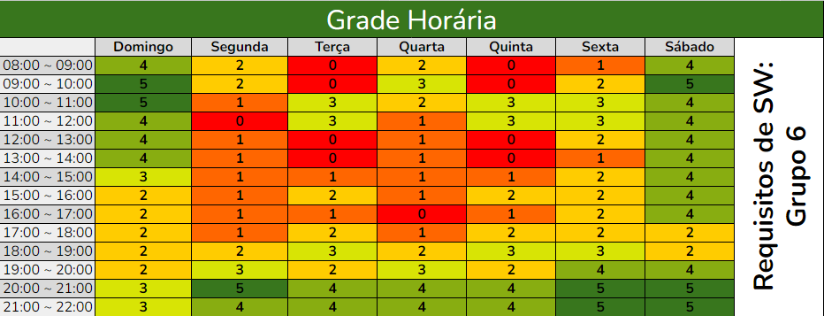

# Heatmap de Disponibilidade dos Integrantes

## Introdução

Este documento visa facilitar o agendamento de reuniões, mapeando os dias e horários mais convenientes para a equipe. Utilizando um Heatmap (tabela 1 e figura 1), é possível visualizar a disponibilidade de cada membro, variando de 0 (nenhum disponível) a 5 (todos disponíveis), para construir um calendário que promova a participação de todos.

## Heatmap

<b>Tabela 1:</b> Heatmap de disponibilidade dos integrantes do grupo

|       | Domingo | Segunda | Terça | Quarta | Quinta | Sexta | Sábado |
| ----- | ------- | ------- | ----- | ------ | ------ | ----- | ------ |
| 08:00 | 4       | 2       | 0     | 2      | 0      | 1     | 4      |
| 09:00 | 5       | 2       | 0     | 3      | 0      | 2     | 5      |
| 10:00 | 5       | 1       | 3     | 2      | 3      | 3     | 4      |
| 11:00 | 4       | 0       | 3     | 1      | 3      | 3     | 4      |
| 12:00 | 4       | 1       | 0     | 1      | 0      | 2     | 4      |
| 13:00 | 4       | 1       | 0     | 1      | 0      | 1     | 4      |
| 14:00 | 3       | 1       | 1     | 1      | 1      | 2     | 4      |
| 15:00 | 2       | 1       | 2     | 1      | 2      | 2     | 4      |
| 16:00 | 2       | 1       | 1     | 0      | 1      | 2     | 4      |
| 17:00 | 2       | 1       | 2     | 1      | 2      | 2     | 2      |
| 18:00 | 2       | 2       | 3     | 2      | 3      | 3     | 2      |
| 19:00 | 2       | 3       | 2     | 3      | 2      | 4     | 4      |
| 20:00 | 3       | 5       | 4     | 4      | 4      | 5     | 5      |
| 21:00 | 3       | 4       | 4     | 4      | 4      | 5     | 5      |

<b>Fonte:</b> <a href="https://github.com/nickgehjk">Nicolas Bomfim</a>, 2024

<b>Figura 1:</b> Heatmap de disponibilidade dos integrantes do grupo

<b>Fonte:</b> <a href="https://github.com/nickgehjk">Nicolas Bomfim</a>, 2024

## Resultados

As reuniões ficaram marcadas para domingo de manhã, sexta ou sábado a noite ou quando todos estiverem disponíveis em outro horário.

## Bibliografia

> TUFTE, Edward R. The Visual Display of Quantitative Information. 2. ed. Cheshire, CT: Graphics Press, 2001. 
>

## Histórico de versões

| Versão | Data | Descrição | Autor | Revisor |
| :----: | ---- | --------- | ----- | ------- |
| `1.0`  | 04/11/2024 | Criação do documento | [Nicolas Bomfim](https://github.com/nickgehjk) | [Ana Catarina](https://github.com/an4catarina) |
