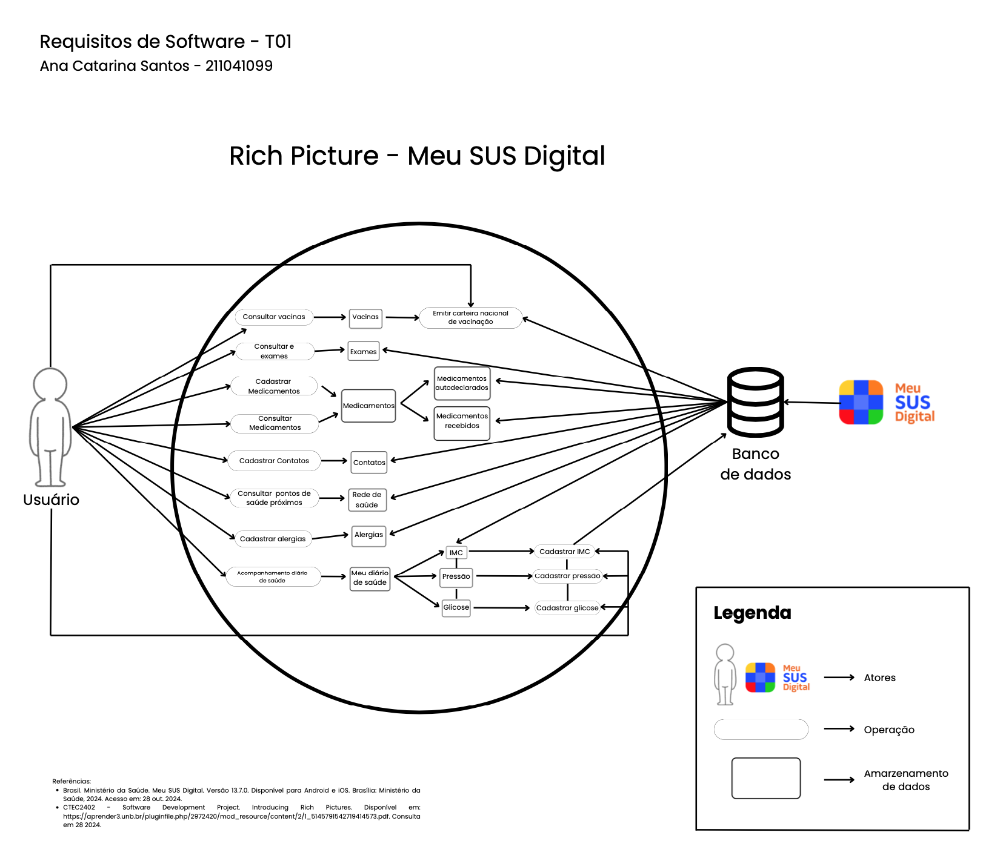
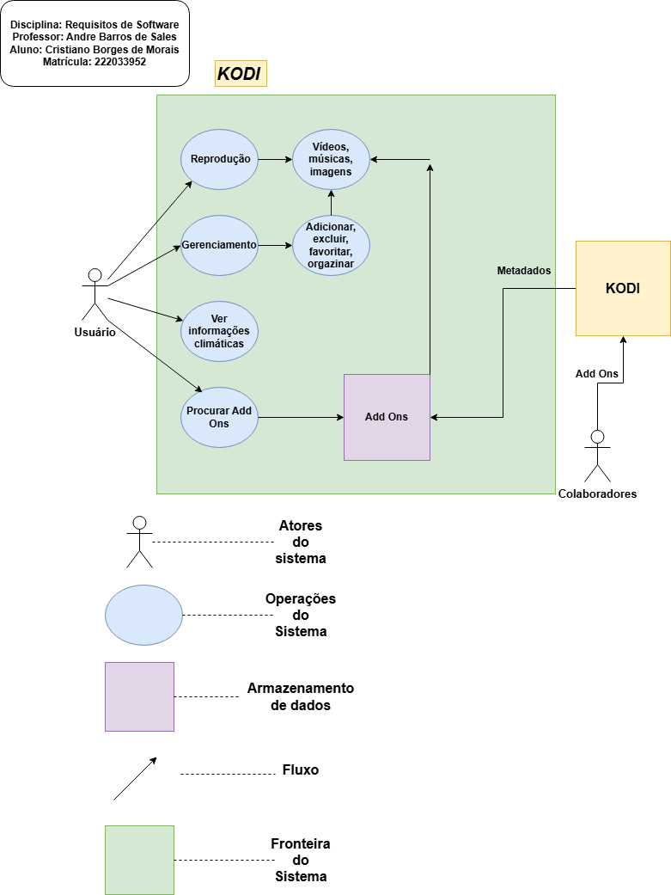
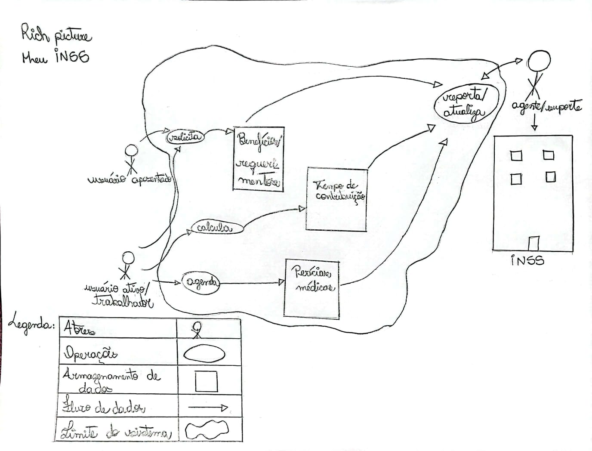
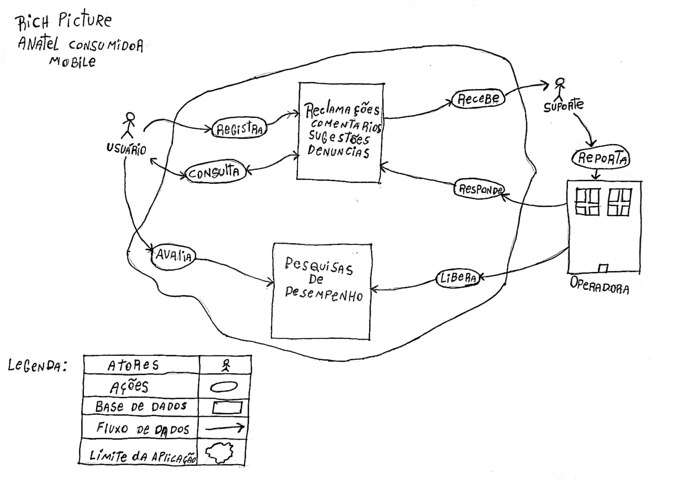
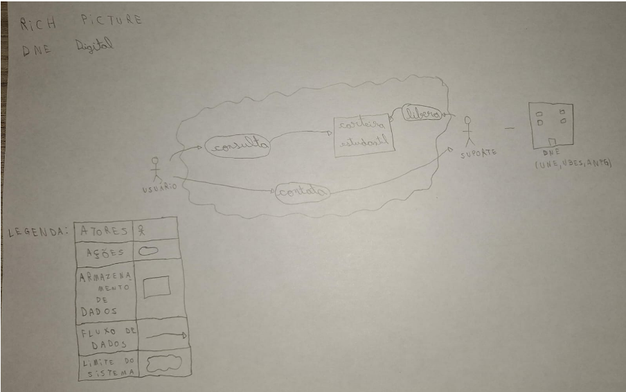

# Aplicativos avaliados

## Introdução

Na fase inicial do projeto, cada membro do grupo deveria selecionar individualmente aplicativos governamentais ou de código aberto,
para analisá-lo de uma forma inicial. Essa escolha tinha como propósito apresentar sugestões para o aplicativo que
seria analisado em conjunto pelo grupo durante a disciplina Requisitos de Software. A Tabela 1 mostra qual aplicativo
foi avaliado por cada membro da equipe.

<b>Tabela 1:</b> Tabela de aplicativos avaliados

  
<table>
  <thead>
    <tr>
      <th>Aplicativo avaliado</th>
      <th>Membro que fez a avaliação</th>
    </tr>
  </thead>
  <tbody>
    <tr>
      <td>Meu SUS Digital</td>
      <td><a href="https://github.com/an4catarina">Ana Catarina</a></td>
    </tr>
    <tr>
      <td>Kodi</td>
      <td><a href="https://github.com/CristianoMoraiss">Cristiano Morais</a></td>
    </tr>
    <tr>
      <td>Meu INSS</td>
      <td><a href="https://github.com/julia-fortunato">Júlia Fortunato</a></td>
    </tr>
    <tr>
      <td>Anatel Consumidor Mobile</td>
      <td><a href="https://github.com/mauricio-araujoo">Maurício Ferreira</a></td>
    </tr>
    <tr>
    <td>DNE Digital</td>
    <td><a href="https://github.com/nickgehjk">Nicolas Bandeira</a></td>
    </tr>
  </tbody>
</table>

<b>Fonte:</b> <a href="https://github.com/julia-fortunato">Júlia Fortunato</a>, 2024

## Lista de aplicativos avaliados

### Meu SUS Digital

O aplicativo Meu SUS Digital é uma plataforma criada para facilitar o acesso dos brasileiros aos serviços e informações do Sistema Único de Saúde (SUS). Com ele, é possível conferir o histórico de atendimentos, resultados de exames, informações sobre vacinas e a disponibilidade de medicamentos. A ferramenta agiliza o atendimento e integra os dados de saúde, proporcionando mais autonomia e praticidade. Além disso, permite localizar unidades de saúde próximas, agendar consultas e acessar documentos importantes. Esse sistema foi selecionado para avaliação pela integrante Ana Catarina Santos, com a análise, foram levantados os seguintes pontos:

- Acesso Fácil e Navegação Simples: O sistema Meu SUS Digital traz uma interface intuitiva, permitindo que usuários de todos os níveis de experiência tecnológica acessem informações de saúde com facilidade.

- Funcionalidades Abrangentes: O Meu SUS Digital oferece recursos como histórico de atendimentos, exames, vacinação e agendamento de consultas, promovendo uma gestão completa e integrada da saúde do usuário. A plataforma unifica dados dos sistemas público e privado, centralizando as informações em um sistema só.

- Autonomia e Conveniência: Os usuários têm mais autonomia e controle para acessar informações e agendar consultas, eliminando a necessidade de deslocamentos e reduzindo filas nas unidades de saúde.

- Potencial de Expansão e Melhoria: O sistema demonstra ter um grande potencial para adicionar novas funcionalidades, como lembretes de consultas e vacinas, entre outros.

A partir dos pontos analisados, foi criado um rich picture com os pontos de destaque do aplicativo Meu SUS Digital, representado na figura 1.

  
<b>Figura 1: Rich Picture do sistema Meu SUS Digital</b>

  <b>Fonte: <a href="https://github.com/an4catarina">Ana Catarina Santos</a> , 2024</b>

### Kodi

O aplicativo Kodi se trata de um sistema para a reprodução de mídias, é um aplicativo gratuito e de código aberto desenvolvido pela Kodi Foundation. Esse aplicativo está disponibilizado para diversas plataformas e com ele é possível que os seus usuários organizem, reproduzam e visualizem a maioria dos vídeos, músicas, podcasts e outros tipos de arquivos tanto de armazenamento local quanto de rede. Esse aplicativo foi escolhido e analisado pelo integrante Cristiano Morais e foram levantados os seguintes pontos:

- Complexidade: O aplicativo possui uma quantidade razoável de funcionalidades, porém, são funcionalidades de fácil aprendizado e que não demandam muito tempo para aprender. Vale ressaltar que o aplicativo, em uma primeira análise, não apresentou tutoriais/guias de uso das funcionalidades o que pode dificultar sua utilização para usuários que não possuem afinidade com tecnologia.
- Usabilidade: A interface do aplicativo é simples e possui simbologia de fácil reconhecimento e aprendizado.
- Base de usuários: O aplicativo acaba por ser muito nichado, isso pode delimitar a diversidade de usuários e dificultar para o grupo ter contato com algum usuário do aplicativo.

Na figura 2, encontra-se o Rich Picture do aplicativo Kodi.

  
<b>Figura 2: Rich Picture Kodi</b>

  <b>Fonte: <a href="https://github.com/CristianoMoraiss">Cristiano Morais</a> , 2024</b>

### Meu INSS

O aplicativo mobile Meu INSS é uma sistema do governo federal brasileiro para facilitar o acesso a informações e servições de previdência social. Qualquer usuário com cadastro na plataforma gov.br consegue ter acesso a requerimento de benefícios, consulta de extrato de pagamento, simulação de aposentadoria, agendamento de atendimento, consulta da situação de benefícios, dentre outros serviços disponíveis para a sociedade. O sistema foi escolhido pela integrante Júlia Fortunato e os pontos levantados foram:

- Variedade de serviços: o aplicativo possui uma variedade interessante de serviços e funcionalidades;
- Base de usuários: por ser um aplicatico de um órgão muito utilizado e conhecido entre os trabalhadores brasileiros, o app possui um grande número de diversos usuários, com público-alvo dos mais jovens até as pessoas mais idosas;
- O aplicativo oficial do Meu INSS é desenvolvido e mantido pelo governo brasileiro, o que o torna app governamental.

Na figura 3, encontra-se o Rich Picture do aplicativo Meu INSS.

  
<b>Figura 3: Rich Picture Meu INSS</b>

  <b>Fonte: <a href="https://github.com/julia-fortunato">Julia Fortunato</a> , 2024</b>

### Anatel Consumidor Mobile

O Anatel Consumidor é um aplicativo cuja função é mediar a comunicação entre o cliente e as operadoras telefônicas. Suas funcionalidades consistem em permitir que o cliente escreva uma mensagem em um dos quatro tópicos e a envie para a operadora. Os tópicos são reclamações, comentários, sugestões e denúncias. Além disso, o usuário pode consultar as pesquisas de desempenho de todas as operadoras telefônicas do Brasil.

* Base de usuários: O aplicativo não é nichado a um público específico, então qualquer um que seja cliente de uma operadora telefônica brasileira pode utilizá-lo.

* O Anatel Consumidor foi desenvolvido e é mantido pelo governo brasileiro, o que o torna app governamental.

Na figura 4, encontra-se o Rich Picture do aplicativo Anatel Consumidor Mobile.

  
<b>Figura 4: Rich Picture Anatel Consumidor</b>

  <b>Fonte: <a href="https://github.com/mauricio-araujoo">Mauricio Ferreira</a> , 2024</b>

### DNE Digital

O DNE digital é um aplicativo mobile para consultar o documento estudantil oficial, contendo informações do usuário, como por exemplo, foto, instituição de ensino, curso e informações pessoais. Possui um QR code que pode ser lido para validar a integridade do documento quando for usado e uma página de suporte ao usuário com "Política de privacidade" e "Fale conosco".

- Base de usuários: O aplicativo é seletivo e utilizado apenas por estudantes que possuem a carteirinha.
- Usabilidade: A interface do aplicativo é simples e de fácil reconhecimento e aprendizado.
- Complexidade: O aplicativo não possui funcionalidades distintas, apenas a consulta do documento.

Na figura 5, encontra-se o Rich Picture do aplicativo DNE Digital.

  
<b>Figura 5: Rich Picture DNE Digital</b>

  <b>Fonte: <a href="https://github.com/nickgehjk">Nicolas Bomfim</a> , 2024</b>

## Bibliografia

> Meu SUS Digital. Disponível em: https://apps.apple.com/br/app/meu-sus-digital/id1045754608. Acesso em: 28/10/2024.
>
> Kodi, Google Play. Disponível em: https://play.google.com/store/apps/details?id=org.xbmc.kodi&hl=pt_BR. Acesso em: 03/11/2024.
>
> Meu INSS, Google Play. Disponível em: https://play.google.com/store/apps/details?id=br.gov.dataprev.meuinss&hl=pt_BR. Acesso em: 03/11/2024.
>
> Anatel Consumidor, Google Play. Disponível em: https://play.google.com/store/apps/details?id=br.com.anatel.consumidor&hl=pt_BR. Acesso em: 03/11/2024.
>
> DNE Digital, Google Play Disponível em: https://play.google.com/store/apps/details?id=br.com.dnedigital&pcampaignid=web_share. Acesso em: 04/11/2024.

## Histórico de versões

| Versão | Data       | Descrição                                                | Autor                                                 | Revisor |
| :----: | ---------- | -------------------------------------------------------- | ----------------------------------------------------- | :-----: |
| `1.0`  | 28/10/2024 | Criação do documento, introdução, adição do app Meu INSS | [Júlia Fortunato](https://github.com/julia-fortunato) |    -    |
| `1.1`  | 02/11/2024 | Adição do app Meu SUS Digital | [Ana Catarina](https://github.com/an4catarina) |    -    |
| `1.2`  | 02/11/2024 | Adição do app Kodi | [Cristiano Morais](https://github.com/CristianoMoraiss) |    -    |
| `1.3`  | 02/11/2024 | Adição do app Anatel Consumidor Mobile | [Maurício Ferreira](https://github.com/mauricio-araujoo) |    -    |
| `1.4`  | 04/11/2024 | Adição do app DNE Digital | [Nicolas Bomfim](https://github.com/nickgehjk) |    -    |
| `1.4`  | 05/11/2024 | Revisão de todos os apps avaliados | [Ana Catarina](https://github.com/an4catarina)   [Maurício Ferreira](https://github.com/mauricio-araujoo)   [Cristiano Morais](https://github.com/CristianoMoraiss)   [Nicolas Bomfim](https://github.com/nickgehjk)   [Júlia Fortunato](https://github.com/julia-fortunato)|    [Ana Catarina](https://github.com/an4catarina)   [Maurício Ferreira](https://github.com/mauricio-araujoo)   [Cristiano Morais](https://github.com/CristianoMoraiss)   [Nicolas Bomfim](https://github.com/nickgehjk)   [Júlia Fortunato](https://github.com/julia-fortunato)|    |

