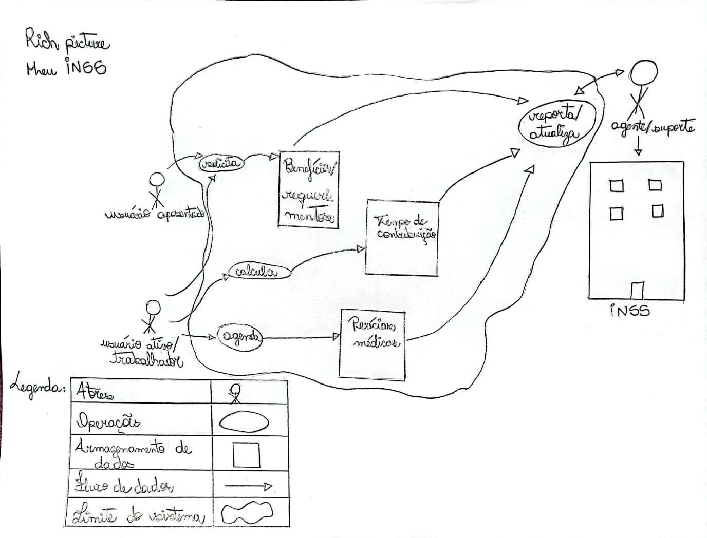

# Rich Picture

## 
Introdução

  
 Rich picture se trata de uma imagem criada no intuito de se visualizar os elementos de um sistema assim como seu funcionamento de maneira simples e direta. Com essa ferramenta é mais fácil ver informações como processos do sistema, atores que participam dos processos e suas funções, fluxo de atividades além de conflitos e possíveis erros.[1] 

  
 A partir da Rich Picture produzida para o aplicativo "Meu INSS" é possível observar as relações das atividades com os atores além de outras informações, e também possui uma legenda para faciliar a compreensão da simbologia utilizada. 

  
<b>Figura 1: Rich Picture Meu INSS</b>

  <b>Autor: <a href="https://github.com/julia-fortunato">Julia Fortunato</a> , 2024</b>

## 
Bibliografia

> [1] CTEC2402 - Software Development Project. Introducing Rich Pictures. Disponível em: https://aprender3.unb.br/pluginfile.php/2972420/mod_resource/content/2/1_5145791542719414573.pdf. Acesso em 25 de outubro de 2024.

## 
Histórico de Versões

| Versão | Data       | Descrição            | Autor                                                   | Revisor                                               |
| :----: | ---------- | -------------------- | ------------------------------------------------------- | ----------------------------------------------------- |
| `1.0`  | 28/10/2024 | Criação do documento | [Cristiano Morais](https://github.com/CristianoMoraiss) | [Júlia Fortunato](https://github.com/julia-fortunato) |
