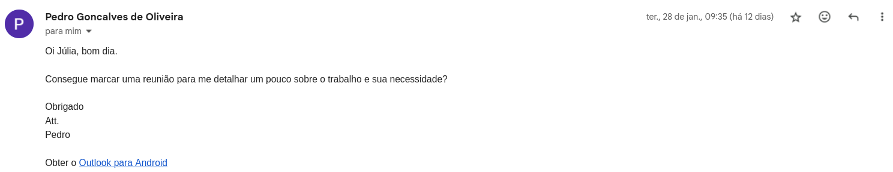

# Comprovação Informal

## Introdução

Com o período de validação do projeto, é importante entender se o produto atende as expectativas e necessidades do usuário. 

A comprovação informal tem como principal objetivo obter a comunicação com os responsáveis pelo aplicativo que está sendo avaliado, a fim de obter a validação desse público, que entende de forma ampla sobre o Meu INSS.

## Método de comunicação

Para realizar a solicitação de validação, foram enviadas mensagens utilizando plataforma de correio eletrônico, que no caso da equipe, foi o Gmail. Esse contato mais direto foi possível por meio de uma colaboração com o professor da disciplina, André Barros. 

A comunicação inicial foi feita no dia 28 de janeiro de 2025, às 9h11. 

Portanto, a comunicação se mostrou eficaz, de modo que, a solicitação e os demais e-mails trocados estão registrados nas Figuras 1 a 5.

A comprovação da reunião no calendário do Microsoft Teams pode ser encontrada na Figura 6.

**Figura 1** - Mensagem por e-mail (Parte 1)

<figure markdown>

Fonte: [Júlia Fortunato](https://github.com/julia-fortunato)

**Figura 2** - Mensagem por e-mail (Parte 2)

<figure markdown>

Fonte: [Júlia Fortunato](https://github.com/julia-fortunato)

**Figura 3** - Mensagem por e-mail (Parte 3)

<figure markdown>

Fonte: [Júlia Fortunato](https://github.com/julia-fortunato)

**Figura 4** - Mensagem por e-mail (Parte 4)

<figure markdown>

Fonte: [Júlia Fortunato](https://github.com/julia-fortunato)

**Figura 5** - Mensagem por e-mail (Parte 5)

<figure markdown>

Fonte: [Júlia Fortunato](https://github.com/julia-fortunato)

**Figura 6** - Reunião agendada no calendário do Microsoft Teams

<figure markdown>

Fonte: [Júlia Fortunato](https://github.com/julia-fortunato)

## Retorno do Meu INSS

O retorno, como observado nas Figuras 2 a 5 foi extremamente positivo. 

A reunião com Pedro e David foi realizada no dia 03/02/2025 às 16h, mas não houve uma gravação dela. Na reunião estavam presentes os membros Ana Catarina, Cristiano e Júlia, e a pauta do encontro foi a explicação do nosso trabalho e da necessidade de validação pelos responsáveis pelo produto/aplicativo.

Dessa forma, Pedro e David indicaram tinham verificado de forma superficial o material, mas que acharam interessante o que por nós foi produzido. Com a reunião, eles foram capazes de entender melhor as nossas necessidades, e pontuaram que fariam a validação do material assim que possível.

Registro, além da comprovação informal descrita neste documento, o nosso profundo agradecimento à equipe do Meu INSS por esse contato inicial.

Até o momento (09/02/2025), ainda não teve-se retorno sobre a validação do material solicitado.

## Bibliografia

> SERRANO, Milene; SERRANO, Maurício. Requisitos - Aula 23. s.d. Disponível em: <https://aprender3.unb.br/pluginfile.php/2972470/mod_resource/content/1/Aula%2310.pdf>. Acesso em: 09 fev. 2025.

## Histórico de Vesões

| Versão | Data | Descrição | Autor(es) | Revisor(es) |
| --- | --- | --- | --- | --- |
| 1.0 | 09/02/2025 | Criação da documentação | [Júlia Fortunato](https://github.com/julia-fortunato) | [Maurício Ferreira](https://github.com/mauricio-araujoo) |
